## 平台使用说明

硬件平台：正点原子STM32MINI开发板（STM32RCT6)

软件平台：STM32CubeMX （版本6.0.1） 、KEIL5（版本5.29）

## 实验说明

实现功能：建立一个工程，并实现LED灯的亮灭

硬件连接：

PA8   ->  LED0

PD2  ->  LED1

说明：有时候程序下载后不实现，可试着复位一下，也可在魔术棒配置中打开下载后复位。但是STLink盗版有时候设置了也没用。

## CubeMx配置

1、打开CubeMX,点击File->New Preject，新建一个工程。
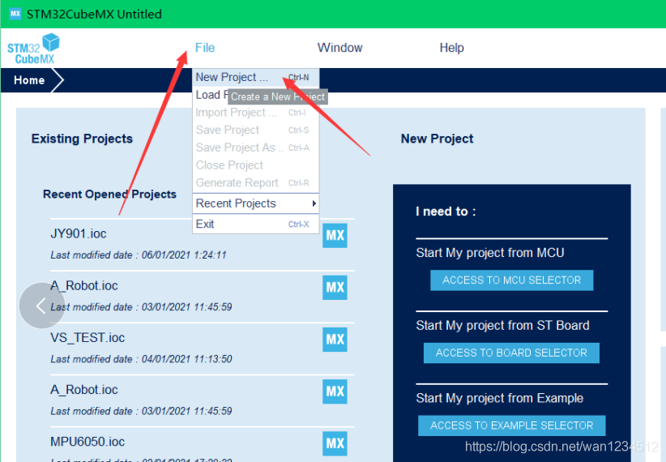

2、此界面一般是联网更新一些东西，动了就不管，长时间不进入就点击取消
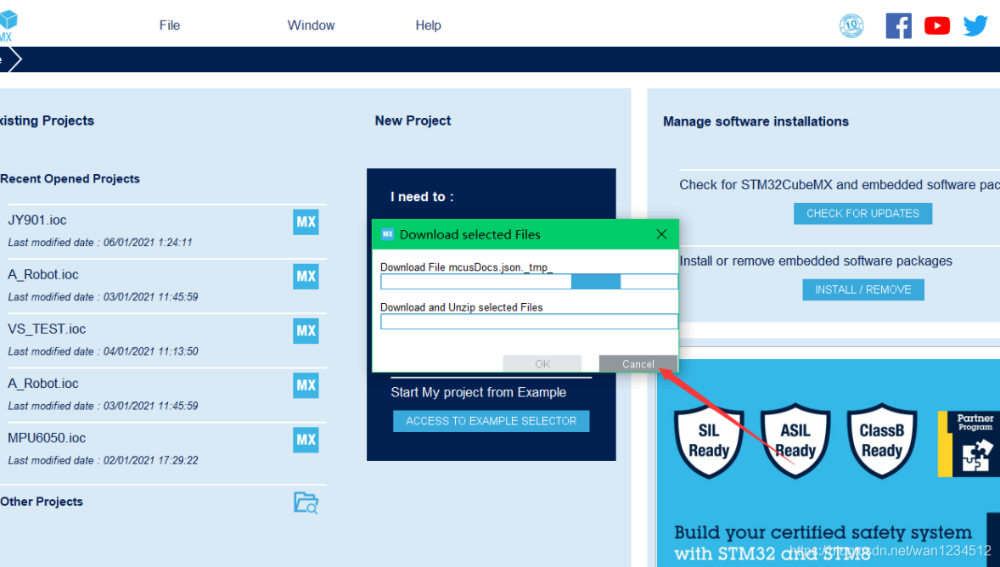

3、可在以下3处选择你的芯片

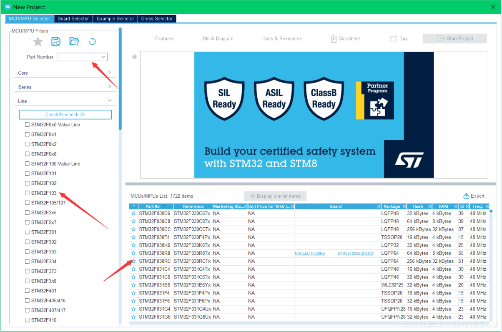

4、选择成功后双击所选芯片

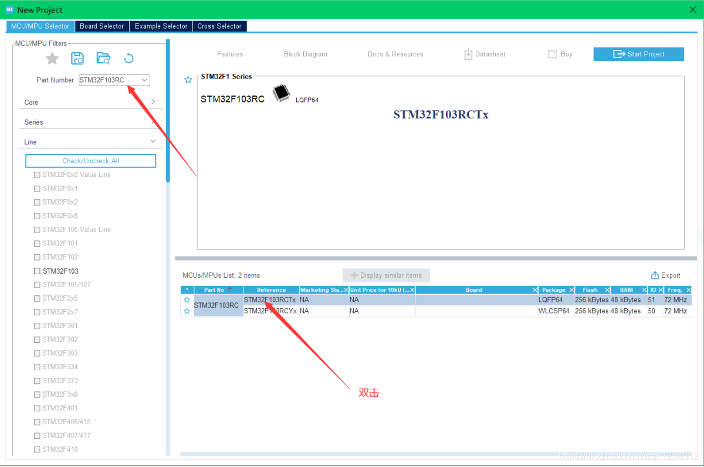

5、先选择打开外部高速时钟，也可选上外部低速时钟，在SYS中DEBUG选择打开SW模式，一定要选一个模式，不然可能会下载一次代码后将芯片锁死。

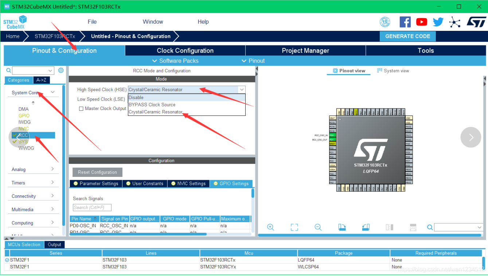

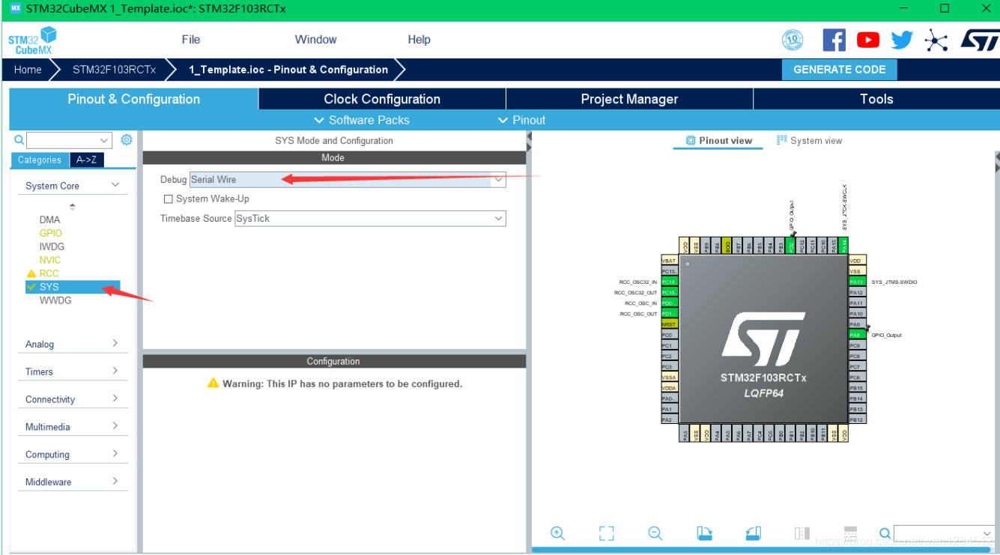

6、在时钟配置模块根据实际情况配置自己想要的时钟。

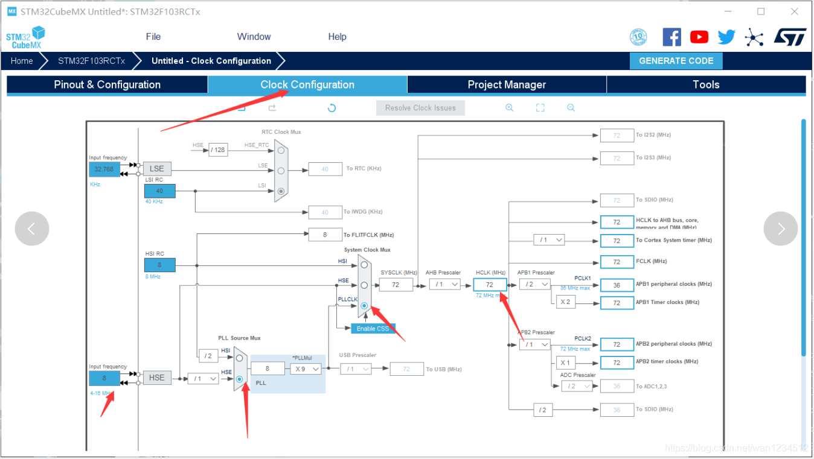

7、点击PA8,选择GPIO_Output模式（IO口输出模式），PD2同理

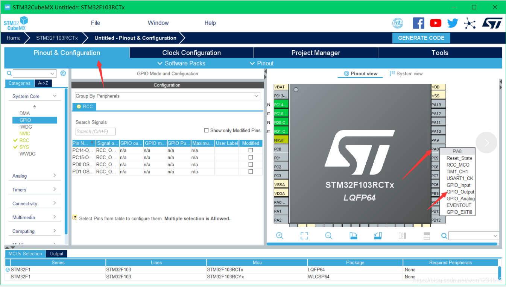

8、点击PA8，将默认输出电平置高，模式设置为推挽输出模式，引脚上拉，输出速度低，PD2配置同理（GPIO属性配置应根据板子实际情况）

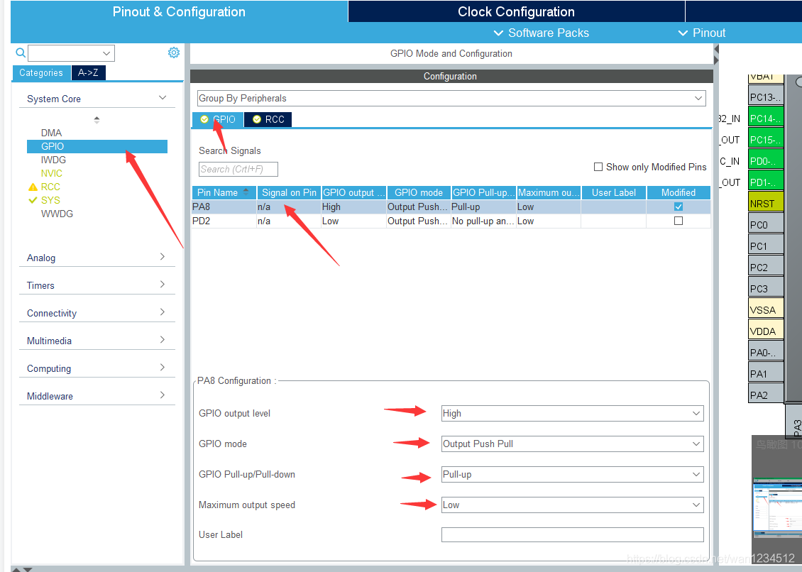

9、配置工程名字，存放路径，记得名字和存放路径最好不要有中文

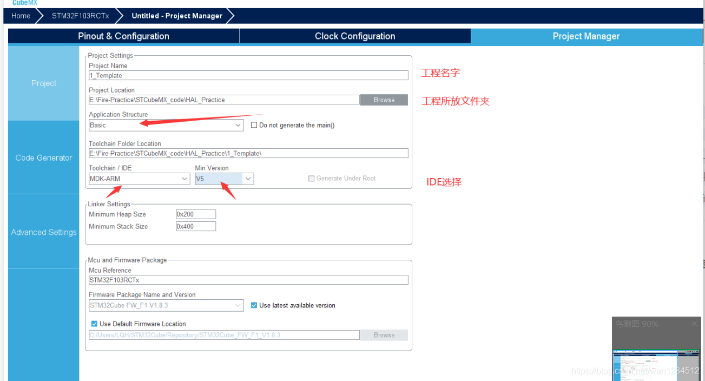

10、配置代码生成，记得勾选图中所选（可根据实际情况自行勾选），然后点击生成代码。

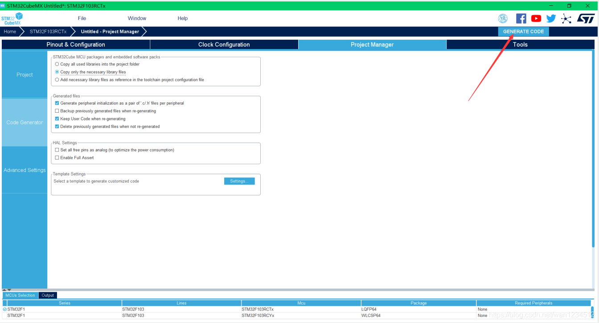

11、一个打开工程文件夹，一个打开工程

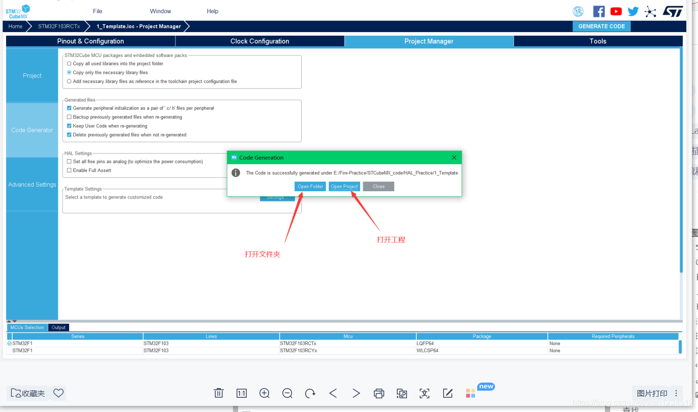

## 代码编写

1、只可在CODE BEGIN 和CODE END间编程，其他地方编程如果使用CUBEMX修改参数重新生成代码会将自己写的代码删除。

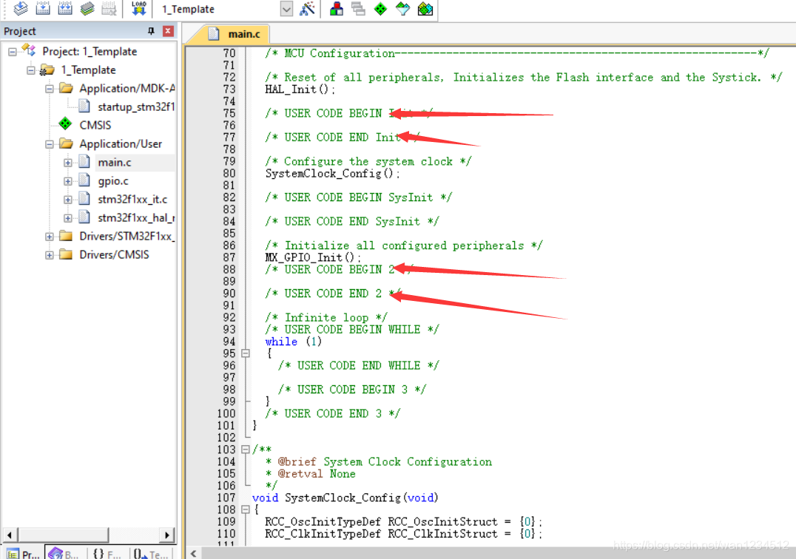

2、测试代码，实现LED闪烁，下载代码到板子方式自选，但是上面配置的是SW模式，我这里就使用SW模式。

```c
while(1)  
{  
    HAL_GPIO_TogglePin(GPIOA,GPIO_PIN_8);  
    HAL_GPIO_WritePin(GPIOD, GPIO_PIN_2, GPIO_PIN_SET);  
    HAL_Delay(500);  
    HAL_GPIO_TogglePin(GPIOA,GPIO_PIN_8);  
    HAL_GPIO_WritePin(GPIOD, GPIO_PIN_2, GPIO_PIN_RESET);  
    HAL_Delay(500);  
}
```

3、以下是GPIO输出常用API

```c
void HAL_GPIO_TogglePin(GPIO_TypeDef *GPIOx, uint16_t GPIO_Pin);  
引脚电平翻转函数  
例：HAL_GPIO_TogglePin(GPIOA,GPIO_PIN_8);  
    将PA8引脚电平进行翻转  
    
void HAL_GPIO_WritePin(GPIO_TypeDef *GPIOx, uint16_t GPIO_Pin, GPIO_PinState PinState);  
写引脚电平状态  
例：HAL_GPIO_WritePin(GPIOD,GPIO_PIN_2,GPIO_PIN_SET);  
   将PD2引脚电平置高  
   HAL_GPIO_WritePin(GPIOD,GPIO_PIN_2,GPIO_PIN_RESET);  
  将PD2引脚电平置低      
 
__weak void HAL_Delay(uint32_t Delay);  
延时函数  
例：HAL_Delay(500);     
    延时500ms
```

>本博客所有文章除特别声明外，均采用 [CC BY-NC-SA 4.0](https://creativecommons.org/licenses/by-nc-sa/4.0/) 许可协议。转载请附上原文出处链接及本声明。
>
>原文链接: https://snqx-lqh.gitee.io/wiki/