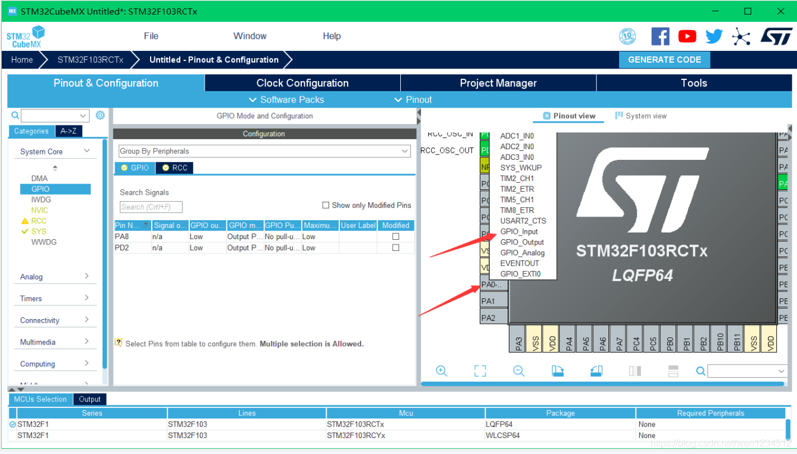
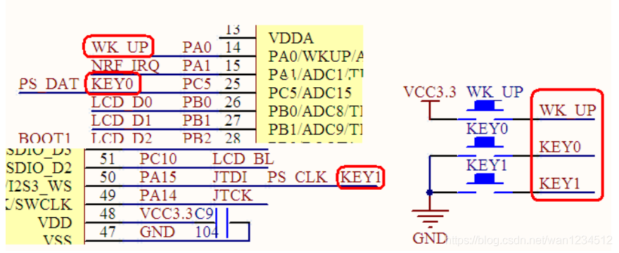
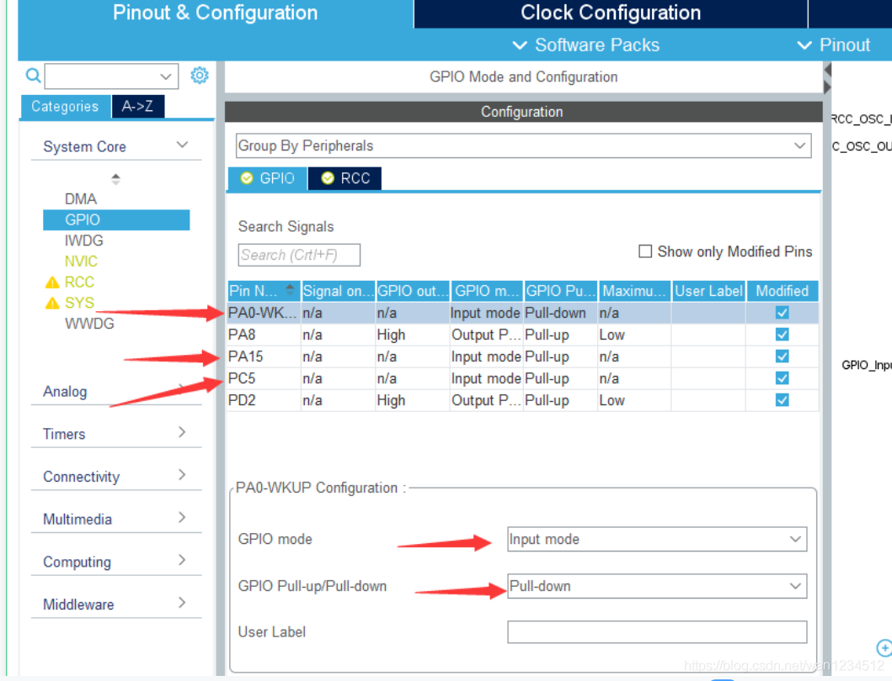

## 平台使用说明

硬件平台：正点原子STM32MINI开发板（STM32RCT6)

软件平台：STM32CubeMX （版本6.0.1） 、KEIL5（版本5.29）

## 实验说明

实现功能：按键控制LED灯亮灭 

硬件连接： 

KEY_UP ->PA0 

KEY_0    ->PC5 

KEY_1    ->PA15 
 
PA8        ->LED0 

PD2        ->LED1 

说明：有时候程序下载后不实现，可试着复位一下，也可在魔术棒配置中打开下载后复位。（仅仅写了关于按键部分，其余初始化未做说明，LED , 时钟初始化，工程生成注意事项见之前新建工程）

## CubeMx配置

1、点击PA0，选择GPIO_Input,PC5,PA15同理。



2、由原理图可得，PA0应配置下拉输入，其他两个应配置上拉输入



3、点击IO口，根据实际情况进行配置，然后生成相关代码



## 代码编写

1、测试代码，按键按下一次，PA8电平翻转一次
```c
while(1)  
{  
    if(HAL_GPIO_ReadPin(GPIOA, GPIO_PIN_0)==1)  
    {  
        HAL_GPIO_TogglePin(GPIOA,GPIO_PIN_8);  
        while(HAL_GPIO_ReadPin(GPIOA, GPIO_PIN_0)==1);  
    }  
}
```

2、以下为按键输入常用API
```c
GPIO_PinState HAL_GPIO_ReadPin(GPIO_TypeDef *GPIOx, uint16_t GPIO_Pin);  
读取引脚电平  
例：i = HAL_GPIO_ReadPin(GPIOA,GPIO_PIN_0);  
    读取PA0的电平值，并将读到的电平值赋值给i.
```

关于按键输入，参考并改进了正点原子的按键检测方法。

```c
#define KEY_UP HAL_GPIO_ReadPin(KEY_UP_GPIO_Port,KEY_UP_Pin)
#define KEY_0  HAL_GPIO_ReadPin(KEY_0_GPIO_Port,KEY_0_Pin)  
#define KEY_1  HAL_GPIO_ReadPin(KEY_1_GPIO_Port,KEY_1_Pin) 

//10MS延时函数
#define KEY_DELAY_10MS() HAL_Delay(10)

/**
  * @brief          返回按键按下的值
  * @param[out]     mode:模式0就是单次扫描，1就是重复检测 time_set:根据周期时间确定延时的时间,有值就是定时器延时，为0就是普通延时
  * @retval         uint8_t 按键值
  */
uint8_t key_scan(uint8_t mode,uint8_t time_set)
{
    static uint8_t keyCount = 0;
    static uint8_t keyState = 0;
	if(mode == 1)  keyState = 0;
    if ((KEY_UP == 1 || KEY_0 == 0 || KEY_1 == 0)  && keyState == 0) //按键按下
    {
		if(time_set == 0)
		{
			KEY_DELAY_10MS();
			keyState = 1;
            if(KEY_UP == 1) return 1;
            else if(KEY_0 == 0) return 2;
			else if(KEY_1 == 0) return 3;
		}else
		{
			keyCount++;
			if (keyCount > time_set ) 
			{
				keyState = 1;
				keyCount = 0;
				if(KEY_UP == 1) return 1;
				else if(KEY_0 == 0) return 2;
				else if(KEY_1 == 0) return 3;
			}
		}
    }
	else if (KEY_UP == 0 && KEY_0 == 1 && KEY_1 == 1 && keyState == 1) //当所有按键都处于抬起状态，状态刷新
    {
        keyCount = 0;
        keyState = 0;
    }
	return 0;
}
```

>本博客所有文章除特别声明外，均采用 [CC BY-NC-SA 4.0](https://creativecommons.org/licenses/by-nc-sa/4.0/) 许可协议。转载请附上原文出处链接及本声明。
>
>原文链接: https://snqx-lqh.gitee.io/wiki/
