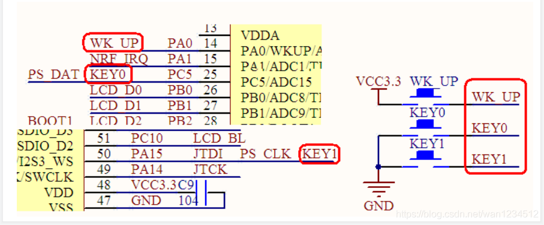
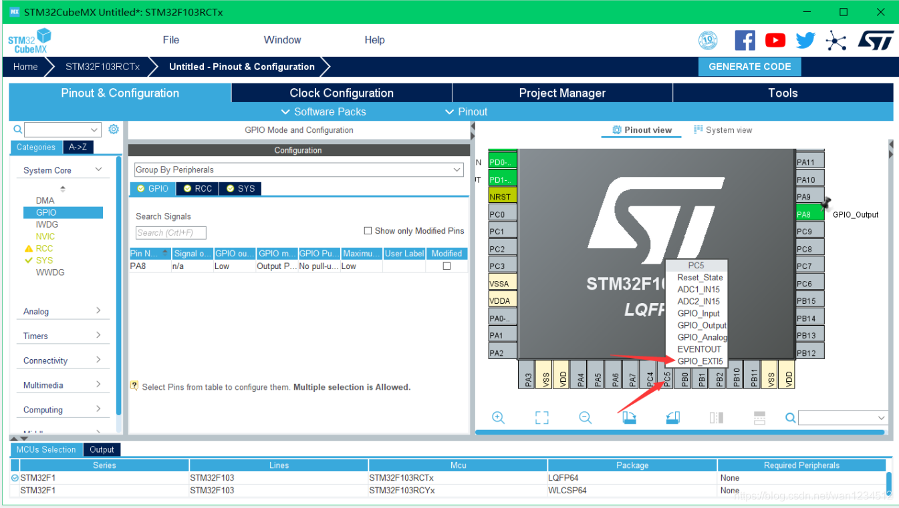
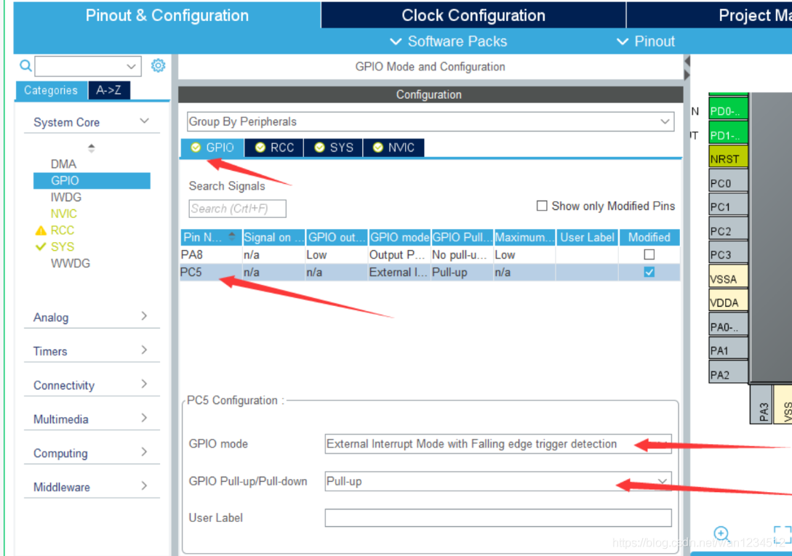
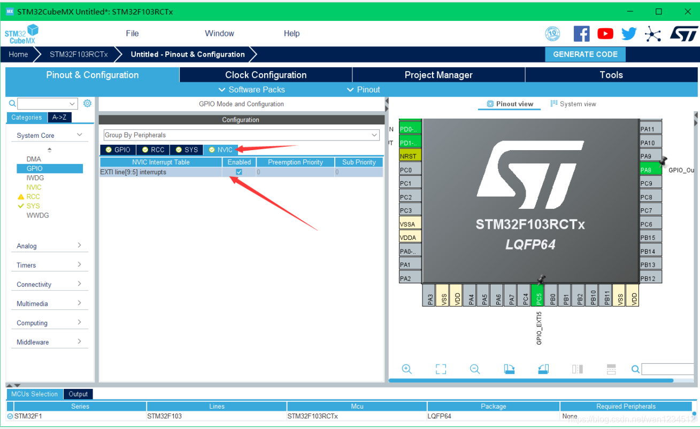
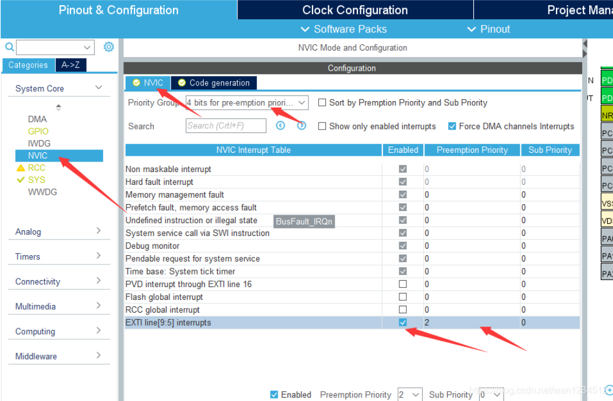
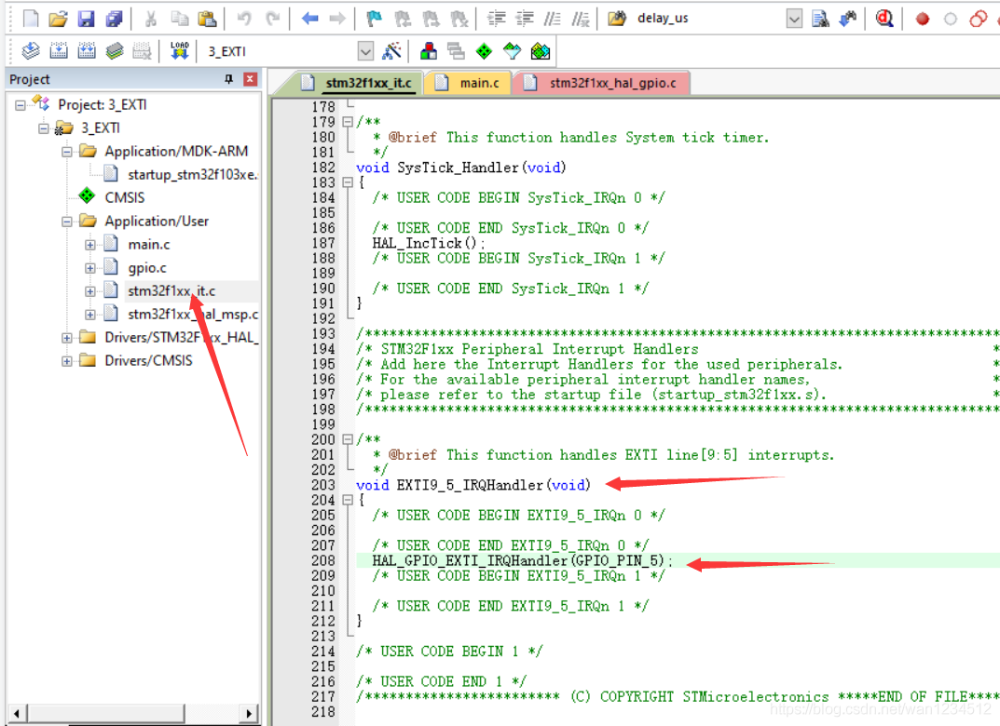
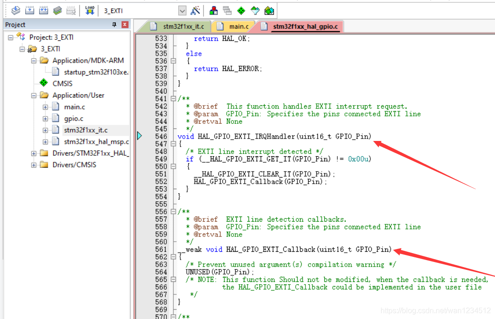
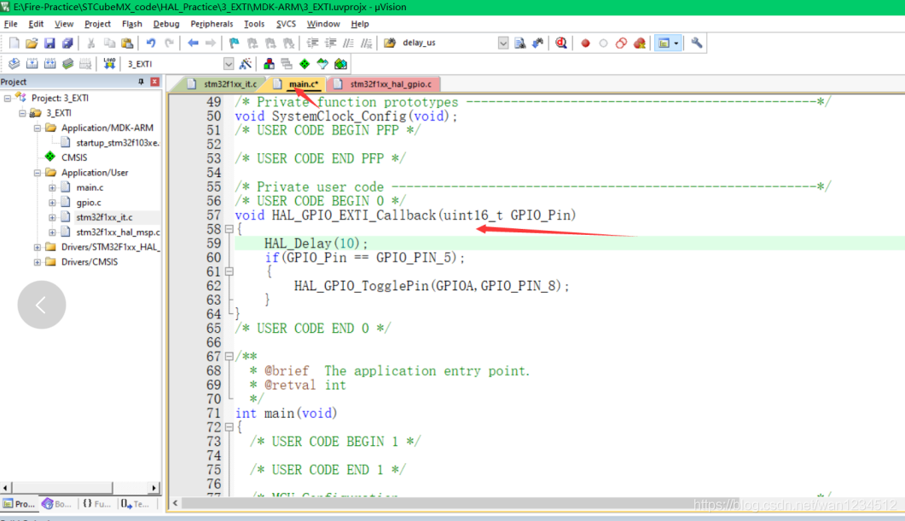
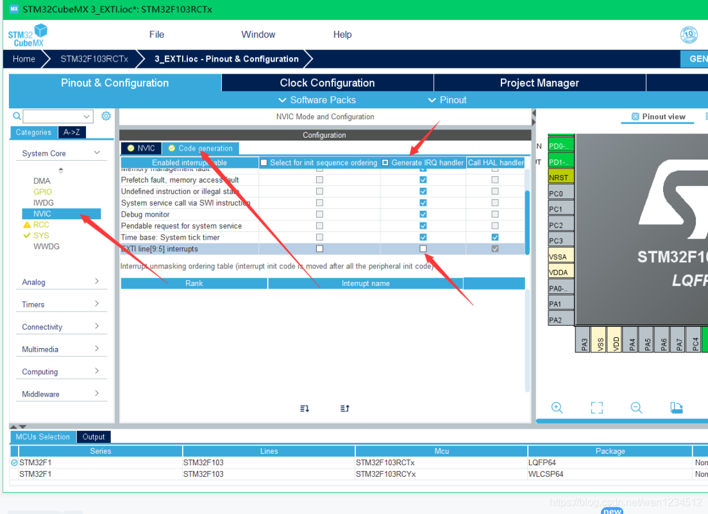
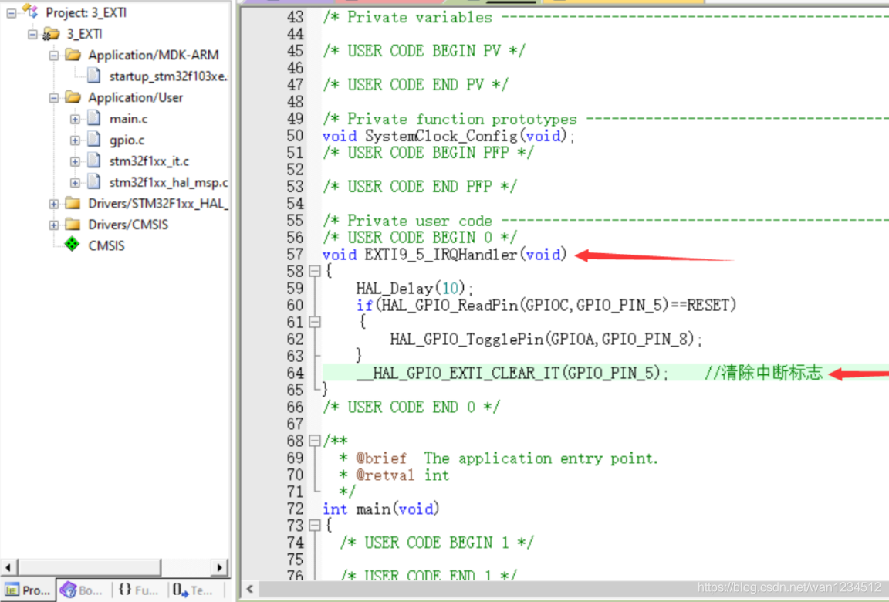

## 平台使用说明

硬件平台：正点原子STM32MINI开发板（STM32RCT6)

软件平台：STM32CubeMX （版本6.0.1） 、KEIL5（版本5.29）

## 实验说明

实现功能：按键实现外部中断控制LED灯亮灭

硬件连接： 

KEY_0 ->PC5 

PA8     ->LED0

说明：有时候程序下载后不实现，可试着复位一下，也可在魔术棒配置中打开下载后复位。（仅仅写了外部中断部分，其余初始化未做说明）

## CubeMx配置

1、由图可知，KEY0会是由下降沿触发外部中断



2、将PC5配置成外部中断



3、点击PC5，配置模式为外部中断下降沿触发。内部上拉



4、点击NVIC,使能外部中断



5、在NVIC界面，选择分组方式，以及配置优先级,`注意配置优先级的时候，尽量大于0，不然可能因为中断中用HAL_Delay()卡死`所有配置完成后，生成代码



## 代码编写

1、在stm32f1xx_it.c中有此外部中断的服务函数



2、点击`HAL_GPIO_EXTI_IRQHandler(GPIO_PIN_5);`转到定义处，可看到其函数定义，`__weak void HAL_GPIO_EXTI_Callback(uint16_t GPIO_Pin)；`为外部中断的回调函数，是一个虚函数，可由用户重新定义。



3、在main.c文件中可重新定义该回调函数，并写关于外部中断的内容，该段代码作用是如果触发中断的是引脚5，翻转电平。




```c
void HAL_GPIO_EXIT_Callback(uint16_t GPIO_Pin)  
{   
	if(GPIO_Pin == GPIO_PIN_5)  
	{  
		HAL_Delay(10); 
		if(HAL_GPIO_ReadPin(GPIOC,GPIO_PIN_5) == 0)
		{
			HAL_GPIO_TogglePin(GPIOA,GPIO_PIN_8); 
		} 
	}  
}
```

在用回调函数时，发现外部中断只会有一个回调函数，不同外部中断触发后调用的是同一个函数，这对有时候想要在不同文件中写不同的

外部中断文件来说可能不太方便，如果有这方面需求，可按照以下方案配置

4、在NVIC的Code generation中，将外部中断线的Generate IRQ handler取消选中，然后生成代码，记得中断还是要使能，只是不生成中断服务函数代码。



5、自己编写中断服务函数代码，记得清除外部中断标志。


```c
void EXTI9_5_IRQHandler(void)  
{  
    HAL_Delay(10);  
    if(HAL_GPIO_ReadPin(GPIOC,GPIO_PIN_5)==RESET)  
    {  
        HAL_GPIO_TogglePin(GPIOA,GPIO_PIN_8);  
    }  
    __HAL_GPIO_EXTI_CLEAR_IT(GPIO_PIN_5);  
}
```

>本博客所有文章除特别声明外，均采用 [CC BY-NC-SA 4.0](https://creativecommons.org/licenses/by-nc-sa/4.0/) 许可协议。转载请附上原文出处链接及本声明。
>
>原文链接: https://snqx-lqh.gitee.io/wiki/