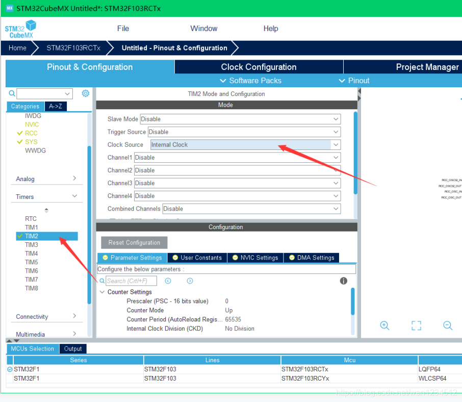
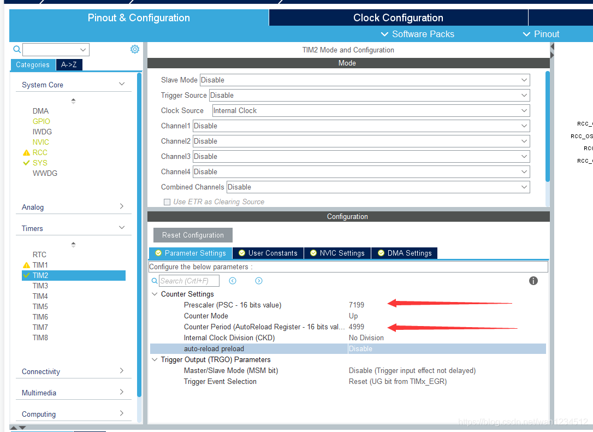
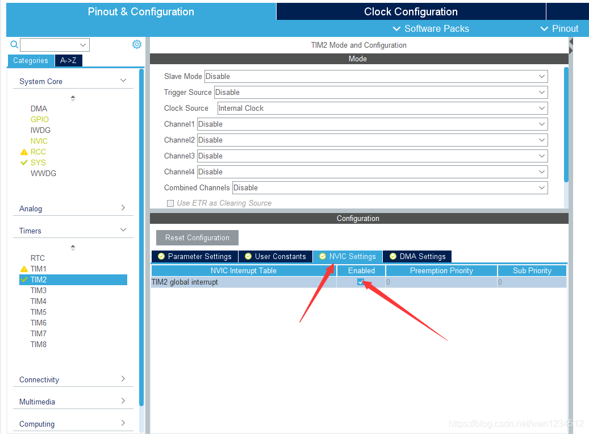
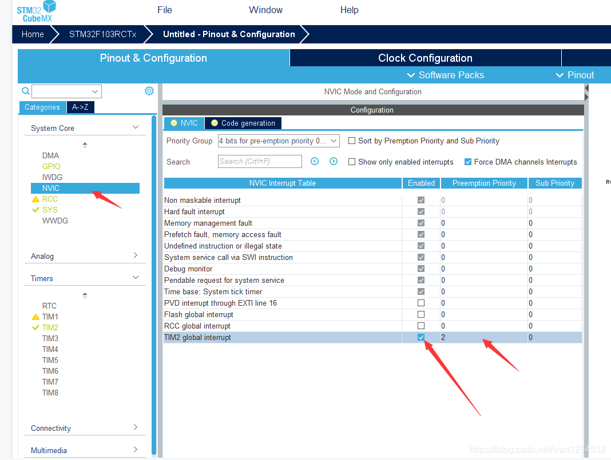
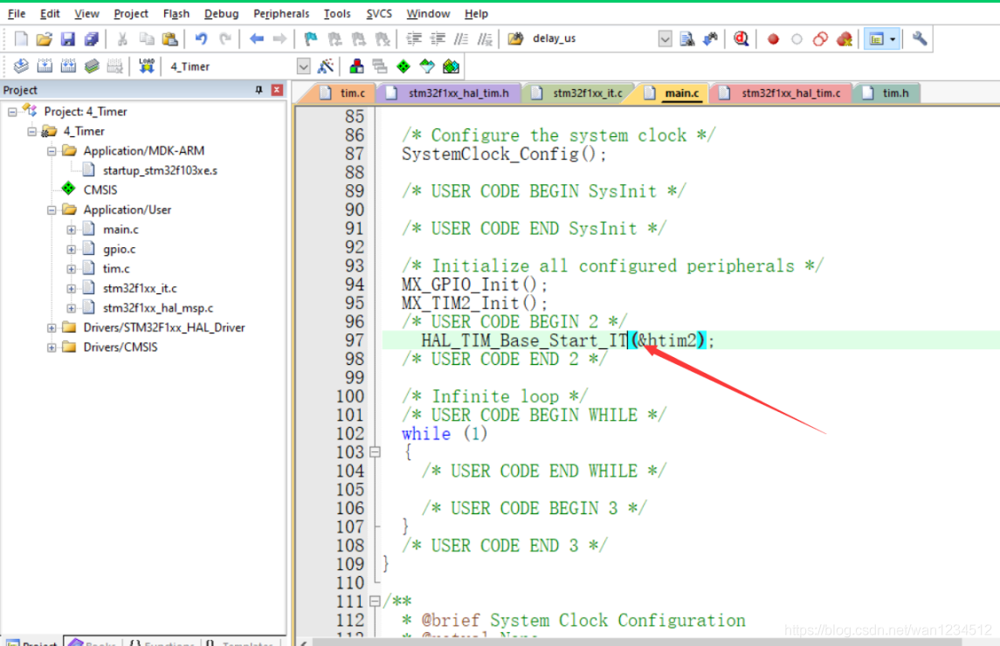
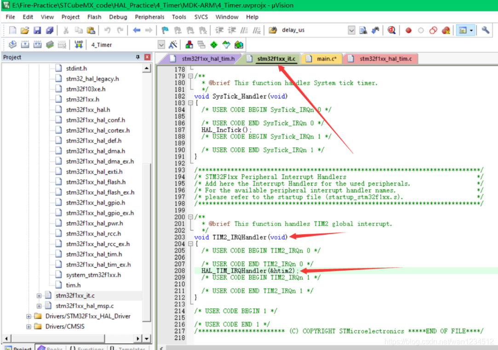
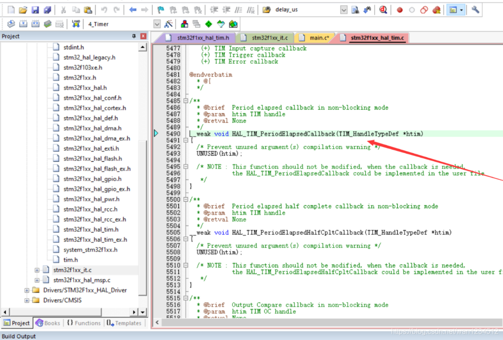
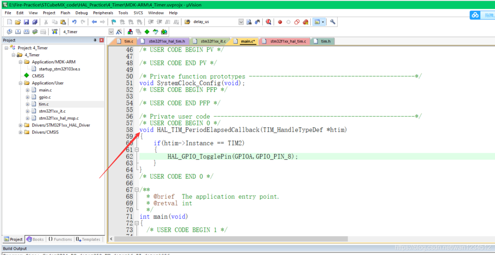
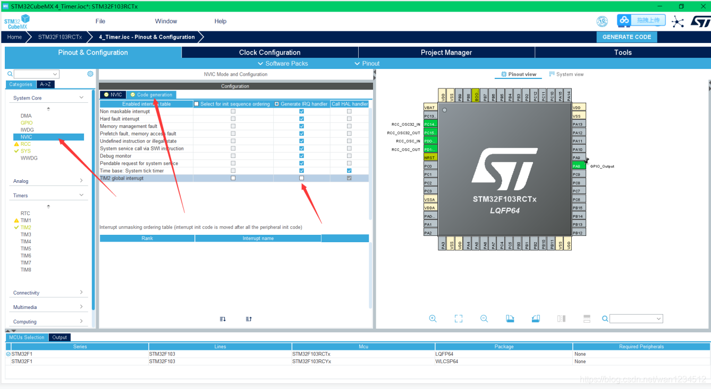
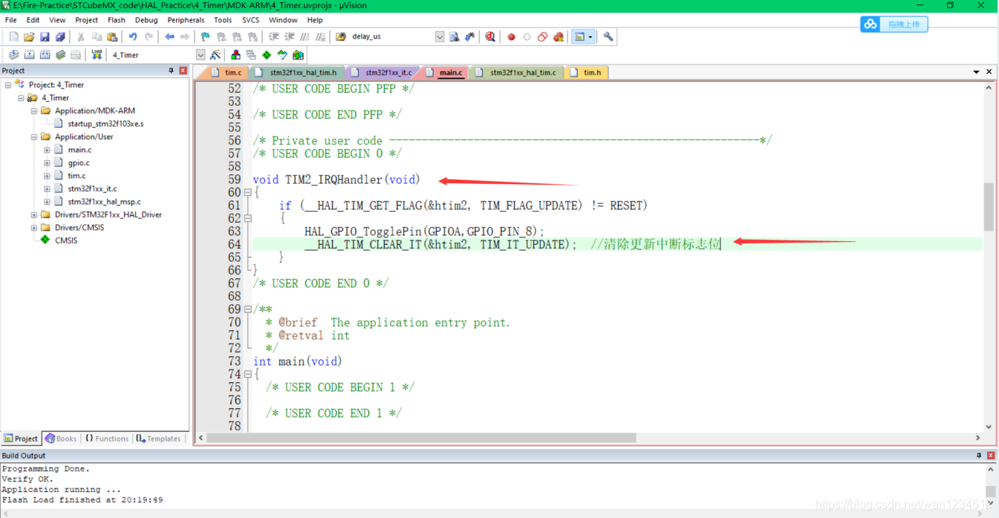

## 平台使用说明

硬件平台：正点原子STM32MINI开发板（STM32RCT6)

软件平台：STM32CubeMX （版本6.0.1） 、KEIL5（版本5.29）

## 实验说明

实现功能：定时器控制LED灯500ms亮灭 

硬件连接： 

PA8 ->LED0 

说明：有时候程序下载后不实现，可试着复位一下，也可在魔术棒配置中打开下载后复位。（仅仅写了定时器中断部分，其余初始化未做说明）

## CubeMx配置

1、选择定时器2，并选择时钟源为内部时钟



2、分频系数设为7199，计数值设为4999，则定的时间为（7199+1）\*（4999+1）/72000000=500ms



3、使能定时器中断



4、选择中断优先级配置。然后生成代码。



## 代码编写

1、使用函数`HAL_TIM_Base_Start_IT(&htim2);`打开定时器2中断



2、`stm32f1xx_it.c`中，有定时器2的中断服务函数，点击`HAL_TIM_IRQHandler(&htim2);`转到定义。


3、关于定时器有很多处理，输入捕获，PWM输出等，我们这里主要看定时器的更新。



4、转到定义，找到`__weak void HAL_TIM_PeriodElapsedCallback(TIM_HandleTypeDef *htim)；`这也是个回调函数，是虚函数。



5、main.c函数中重定义此回调函数，并编写相关代码，代码含义为如果中断由定时器2触发，翻转PA8电平。



```c
void HAL_TIM_PeriodElapsedCallback(TIM_HandleTypeDef *htim)  
{  
    if(htim->Instance == TIM2)  
    {  
        HAL_GPIO_TogglePin(GPIOA,GPIO_PIN_8);  
    }  
}
```

在用回调函数时，发现定时器中断只会有一个回调函数，不同定时器中断触发后调用的是同一个函数，这对有时候想要在不同文件中写不同的定时器中断文件来说可能不太方便，如果有这方面需求，可按照以下方案配置。

6、在NVIC的Code generation中取消生成定时器2的中断服务函数，还是要使能定时器，生成代码，生成代码后还是要打开定时器中断。



7、在main.c中重新写定时器2的中断服务函数，记得清除中断服务函数标志位。 


```c
void TIM2_IRQHandler(void)  
{  
    if(__HAL_TIM_GET_FLAG(&htim2，TIM_FLAG_UPDATE) != RESET)  
    {  
         HAL_GPIO_TogglePin(GPIOA,GPIO_PIN_8);  
         HAL_TIM_CLEAR_IT(&htin2,TIM_IT_UPDATE);//清除更新中断标志  
    }  
}
```

>本博客所有文章除特别声明外，均采用 [CC BY-NC-SA 4.0](https://creativecommons.org/licenses/by-nc-sa/4.0/) 许可协议。转载请附上原文出处链接及本声明。
>
>原文链接: https://snqx-lqh.gitee.io/wiki/