## 平台使用说明

硬件平台：正点原子STM32MINI开发板（STM32RCT6)

软件平台：STM32CubeMX （版本6.0.1） 、KEIL5（版本5.29）

## 实验说明

实现功能：串口控制LED灯亮灭 串口向电脑发送数据 

硬件连接： 

PA8 ->LED0 

说明：有时候程序下载后不实现，可试着复位一下，也可在魔术棒配置中打开下载后复位。（仅仅写了串口部分，其余初始化未做说明）

## CubeMx配置

1、选择串口1，选择模式为异步通讯

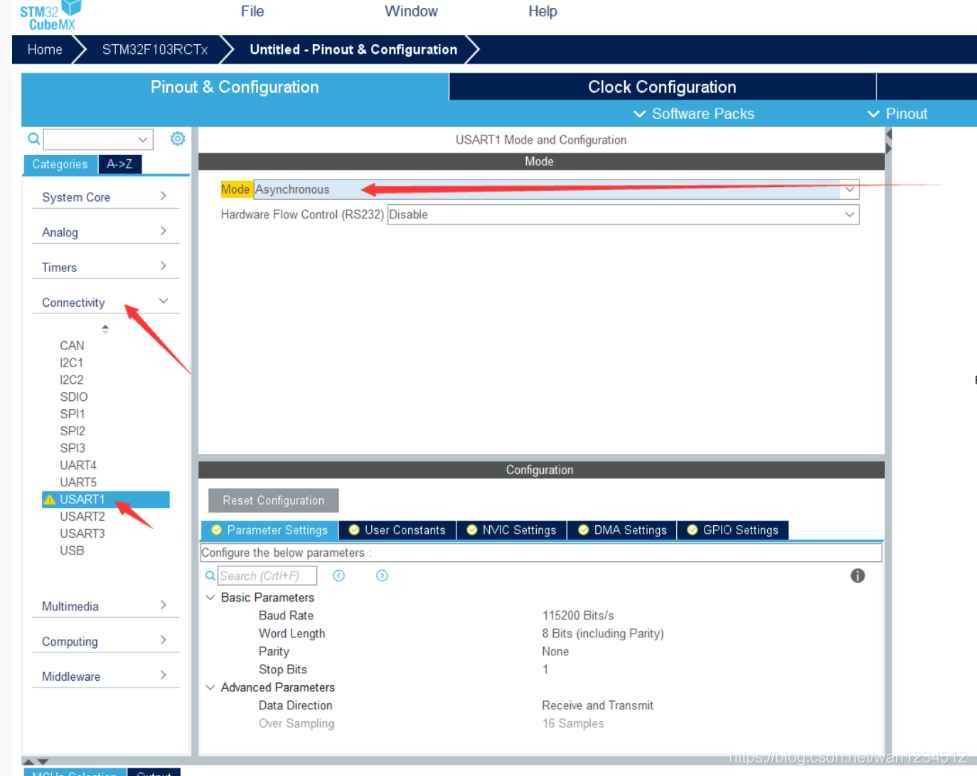

2、配置串口相关数据，波特率此处配置115200，字长此处配置8位，无奇偶校验位，一个停止位，接收和发送都打开。

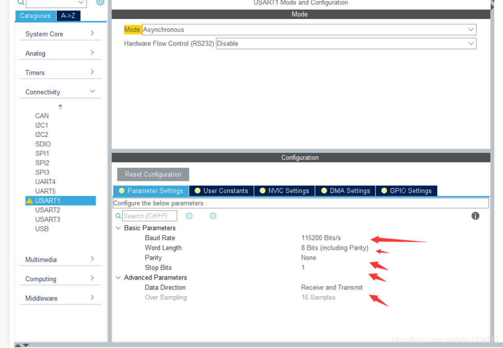

3、打开串口中断

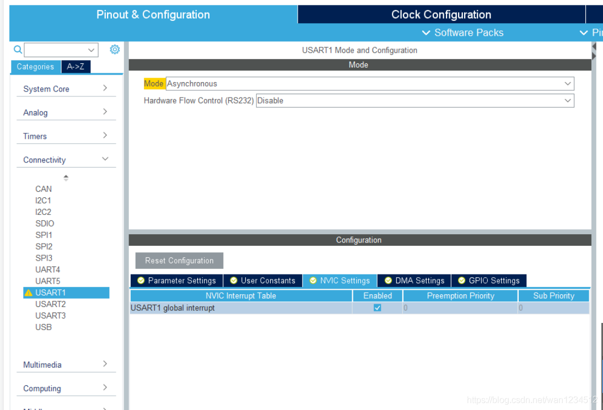

4、查看引脚是否为想要的引脚，假如引脚和实际引脚对不上，则需在图中修改

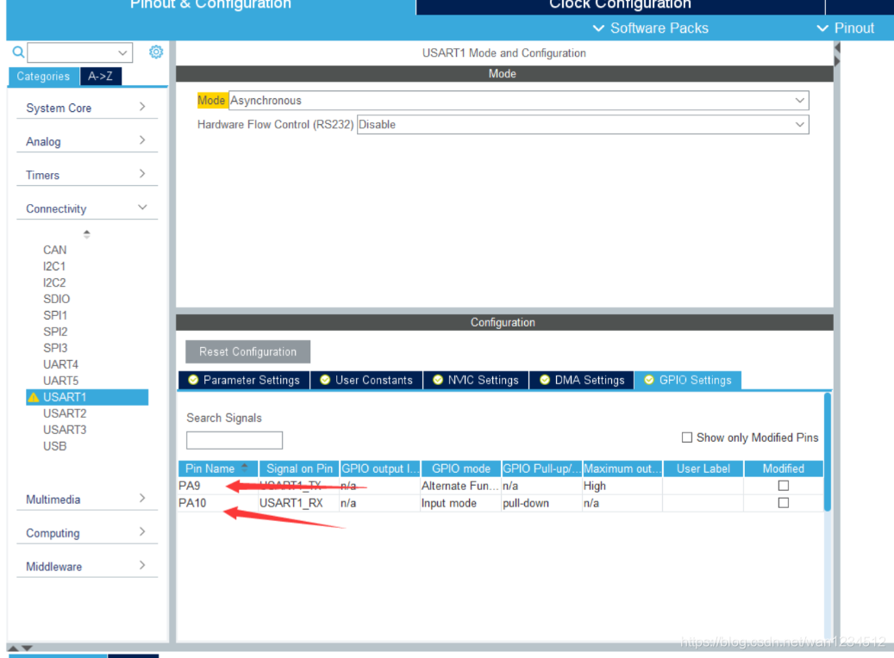

5、假如PB6才为板子硬件实际连接的串口输出，则需通过此步修改，注意此步尤为重要，有的时候引脚不对便实现不了功能，此处就是实际PA9连接不做修改。

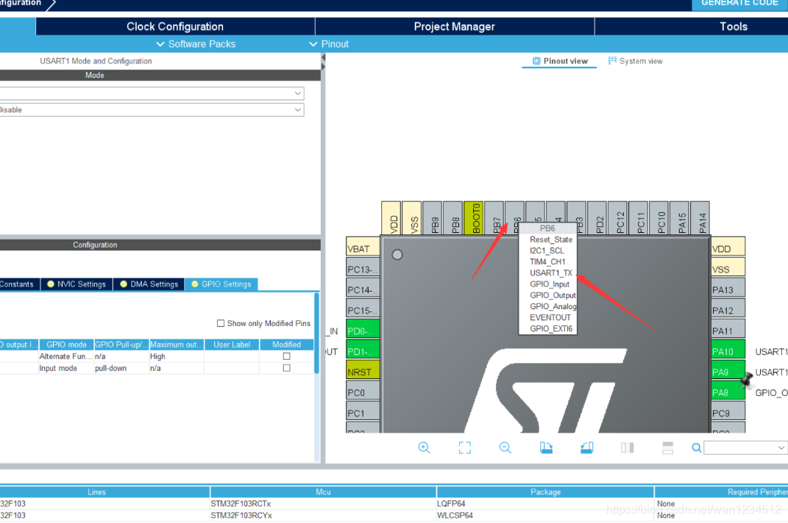

6、配置中断优先级组数，并设置串口中断优先级，生成代码

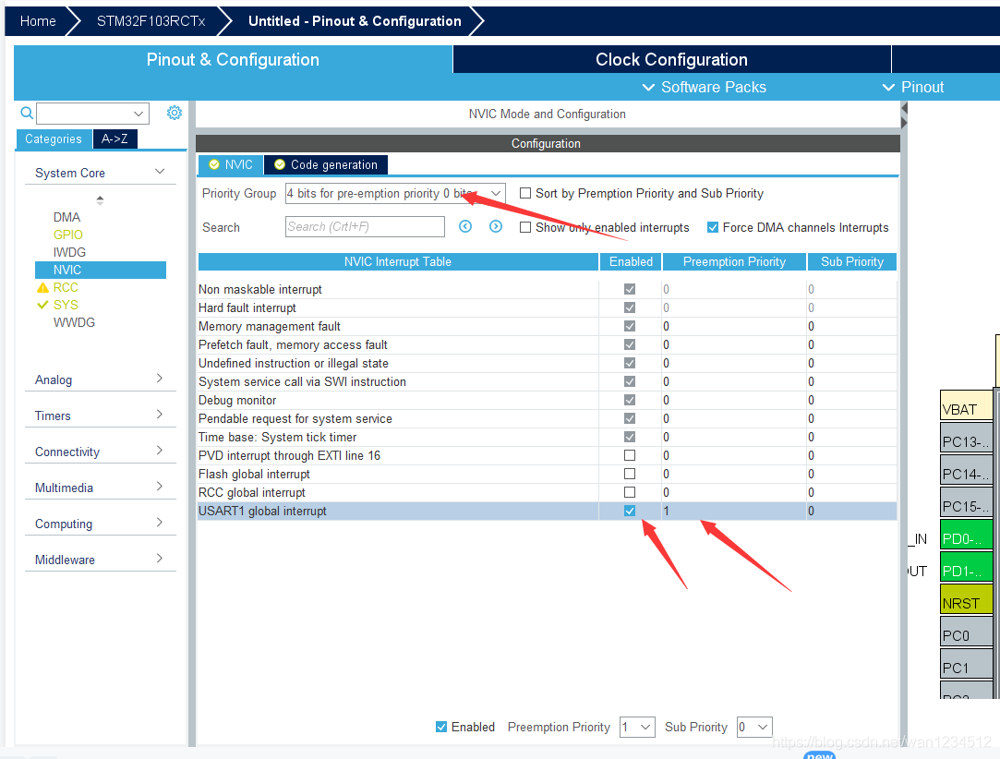

## 代码编写

1、使能串口的接收中断

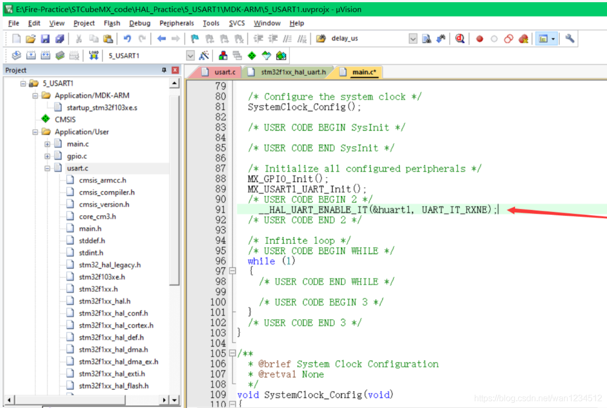

```c
__HAL_UART_ENABLE_IT(&huart1，UART_IT_RXNE);
```

2、在stm32f1xx_it.c文件中有串口一的接收中断服务函数，`HAL_UART_IRQHandler(&huart1)`;转到该函数定义。

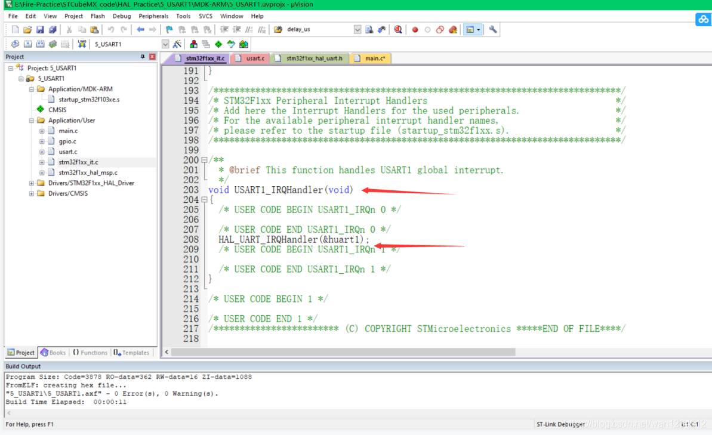

3、该函数有很多处理，可找到接收中断函数`UART_Receive_IT(huart);`，然后转到该函数定义，

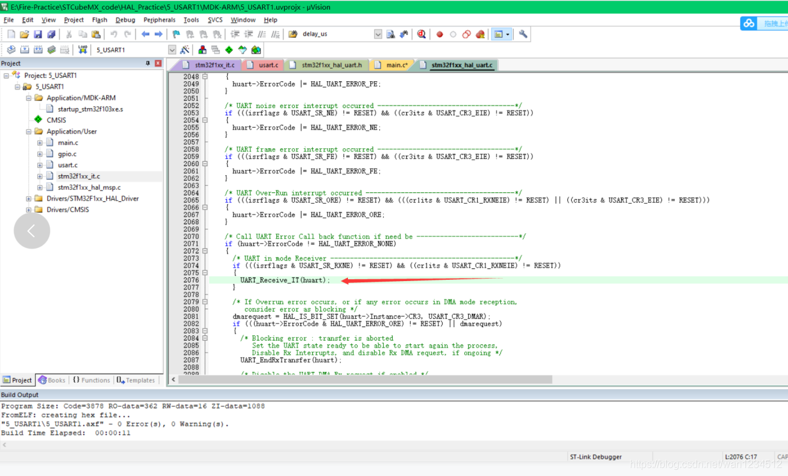

4、里面也有很多处理，找到`HAL_UART_RxCpltCallback(huart);`，接收中断的回调函数。转到该函数定义

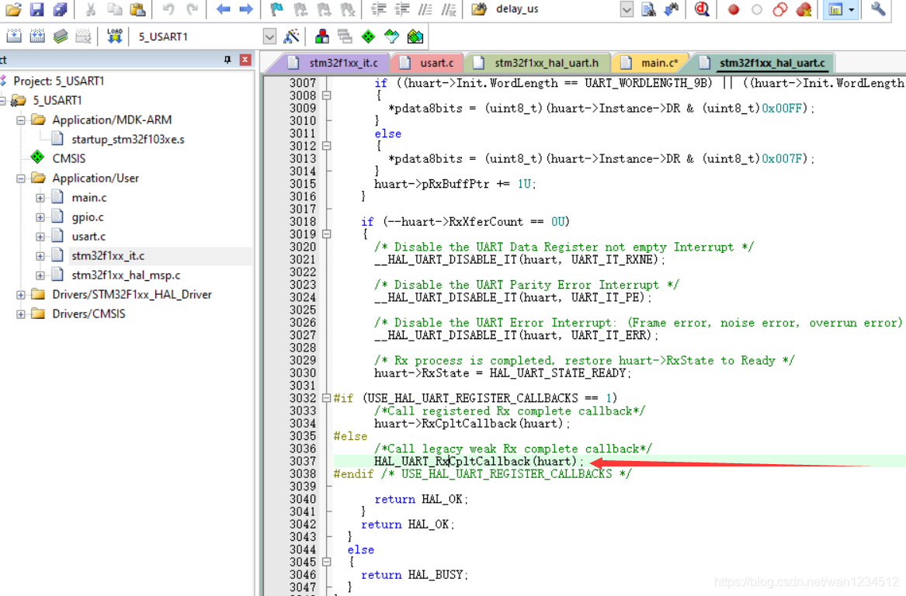

5、可看到该函数定义，`__weak void HAL_UART_RxCpltCallback(UART_HandleTypeDef *huart)`，是个虚函数，用户可重新定义

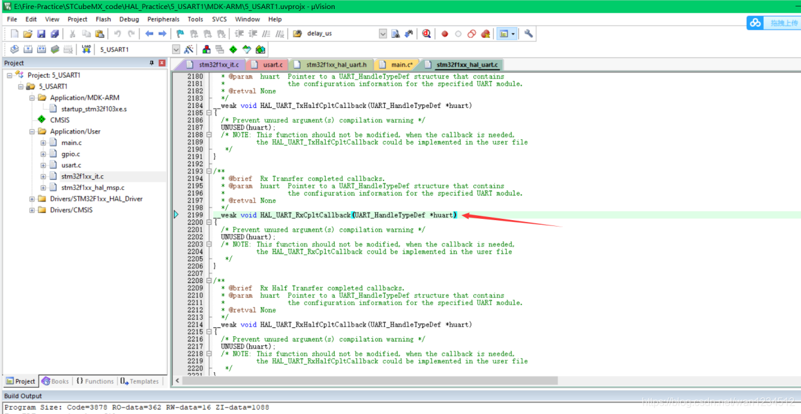

6、在main.c函数中重新定义该回调函数，需注意，使用回调函数的接收，必须要先初始化一个接收的数据，`HAL_UART_Receive_IT(&huart1,&res,1);`此函数要在最开始初始化的时候初始化，而且每次中断执行完毕后也需要一个这个函数，重新定义一个接收空间吧（自己的理解，可能不对）。`HAL_UART_Transmit(&huart1,&res,sizeof(res),100);`将接收到的数据又发送到上位机 可以用串口调试助手测试代码

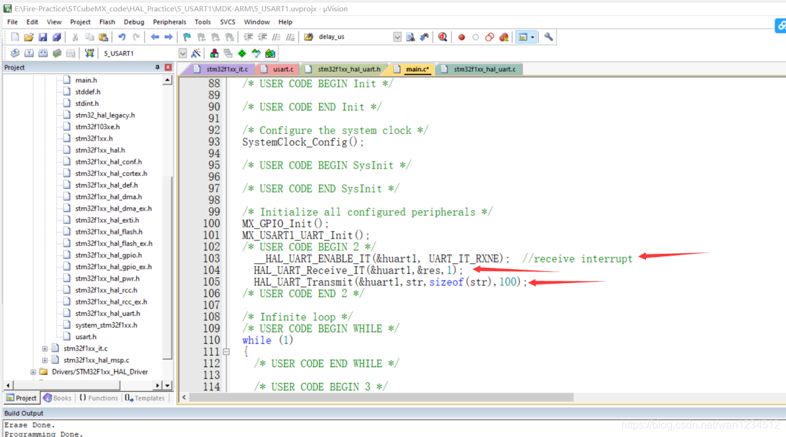

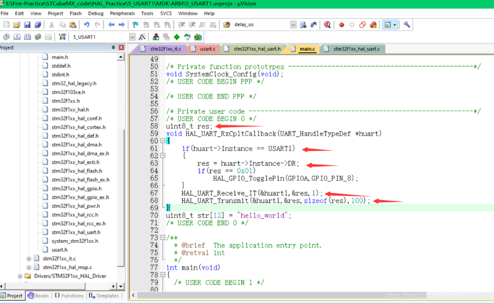

```c
uint8_t res;//定义一个全局变量  
void HAL_UART_RxCpltCallback(UART_HandleTypeDef *huart)  
{  
    if(huart->Instance == USART1)//假如有串口1触发接收中断  
    {  
        res = huart->Instance->DR;//保存接收到的数据  
        if(res == 0x01)//假如接收到的数据是0x01翻转电平  
            HAL_GPIO_TogglePin(GPIOA,GPIO_PIN_8);  
    }  
   //重新定义一个接收，&res是定义的接收数据的地址，1是指1个数据，多个数据接收暂时  
   //不会处理  
    HAL_UART_Receive_IT(&huart1,&res,1);  
   //将接收到的数据发送到上位机  
    HAL_UART_Transmit(&huart1,&res,sizeof(res),100);  
}

```

7、在WHILE(1)前记得初始化一个接收地址空间，记得res是全局变量，发送的str是提前定义的一个“hello_world”字符串

```c
//使能接收中断  
__HAL_UART_ENABLE_IT(&huart1, UART_IT_RXNE);   
​  
//初始化一个接收的地址空间  
HAL_UART_Receive_IT(&huart1,&res,1);  
​  
//发送一个字符串  
//str:数组起始地址  
//sizeof(str)：发送的个数  
//100时间间隔，好像是100ms后还未触发跳出函数  
HAL_UART_Transmit(&huart1,str,sizeof(str),100);
```

用串口回调函数写我感觉要调用的函数太多了，而且有些配置也不是很方便，所以我常选择不使用回调函数，若有相关需求，可按以下配置。

8、在NVIC的code generation 中取消勾选USART1的中断服务函数编写，但还是要使能中断，然后生成代码。

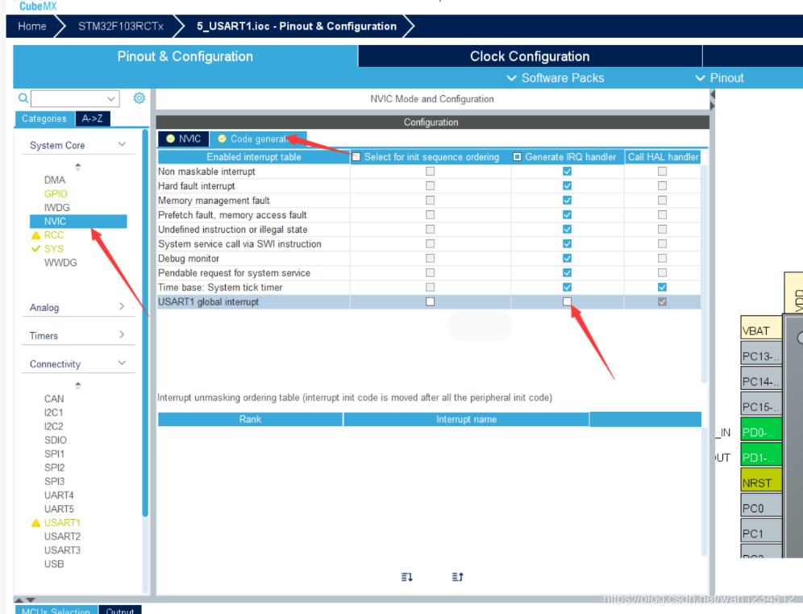

9、在main.c中重新写串口中断函数，记得清除中断标志位，这样写，不使用回调函数，就不需要像之前那样定义一个接收的数据地址。

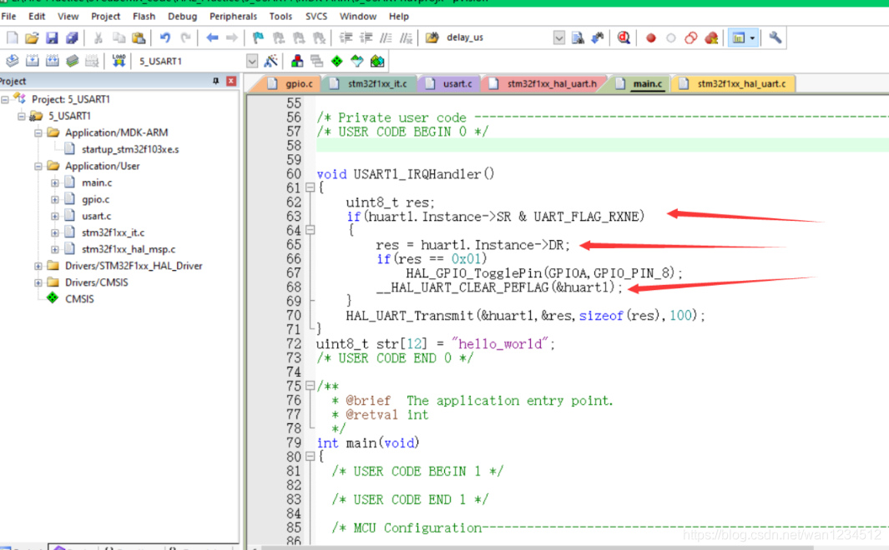

```c
void USART1_IRQHandler()  
{  
    uint8_t res;  
    if(huart1.Instance->SR & UART_FLAG_RXNE)//判断是否满足接收中断  
    {  
        res = huart1.Instance->DR;//获取接收到的数据  
        if(res == 0x01)  
            HAL_GPIO_TogglePin(GPIOA,GPIO_PIN_8);  
        __HAL_UART_CLEAR_PEFLAG(&huart1);//清除中断标志位  
    }  
    HAL_UART_Transmit(&huart1,&res,sizeof(res),100);//发送接收到的数据，做测试  
}
```

10、初始化也只需要打开串口的接收中断就好了 
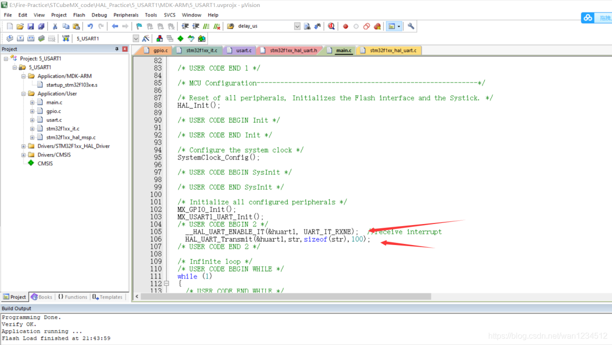

>本博客所有文章除特别声明外，均采用 [CC BY-NC-SA 4.0](https://creativecommons.org/licenses/by-nc-sa/4.0/) 许可协议。转载请附上原文出处链接及本声明。
>
>原文链接: https://snqx-lqh.gitee.io/wiki/