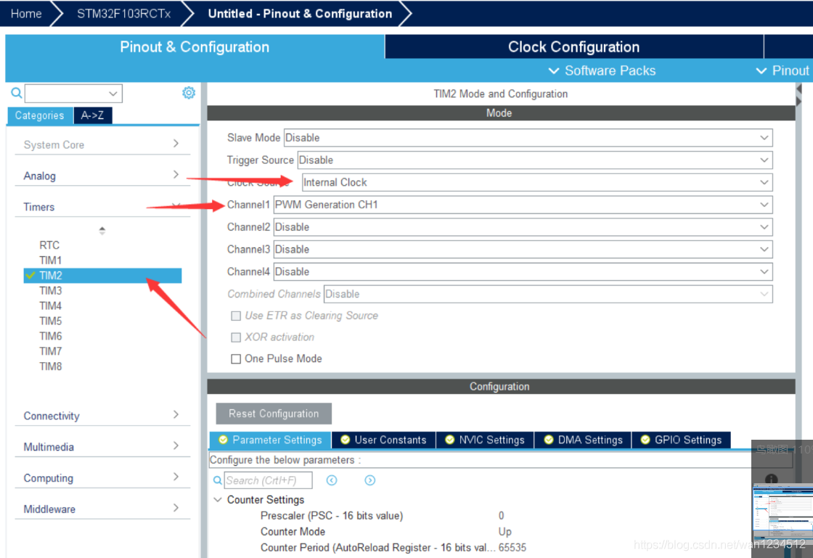
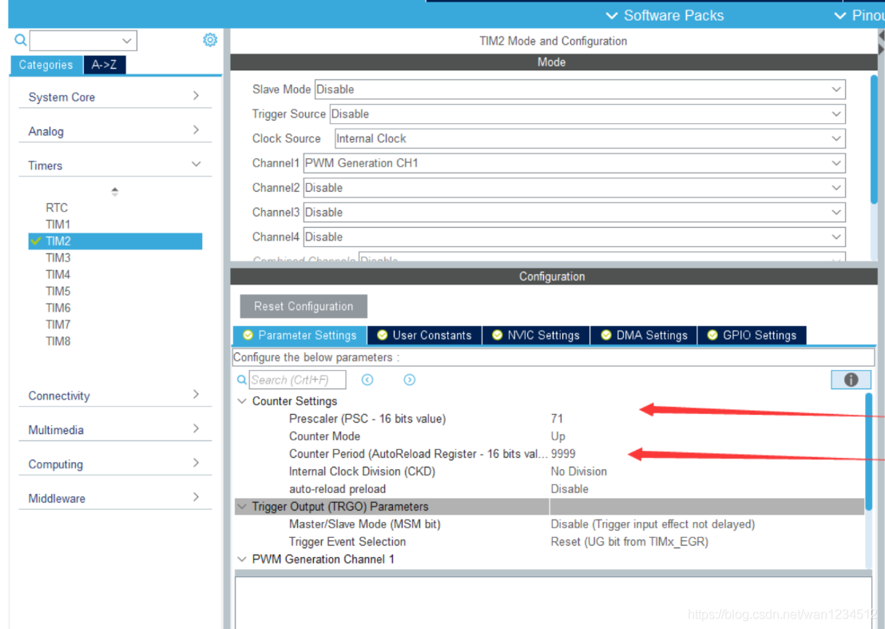
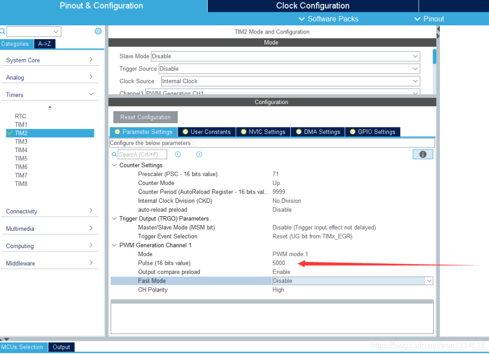
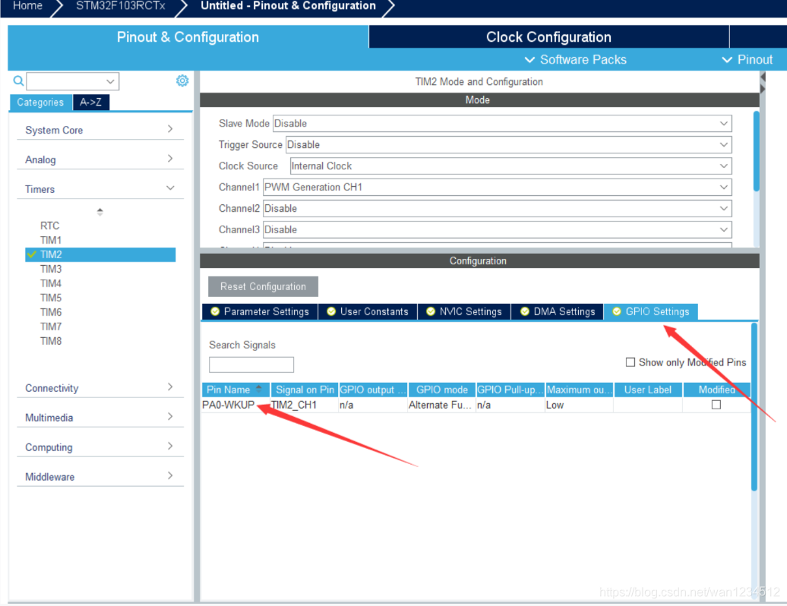
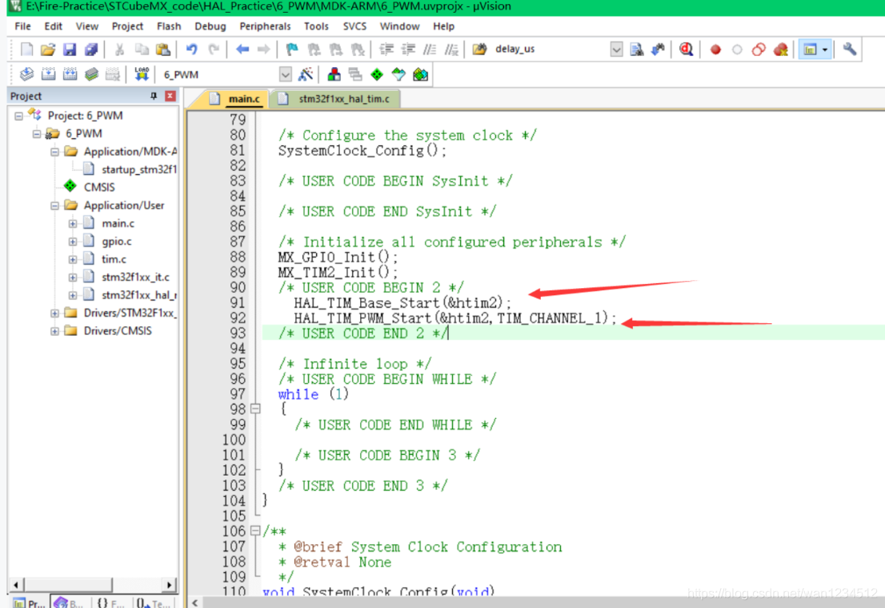
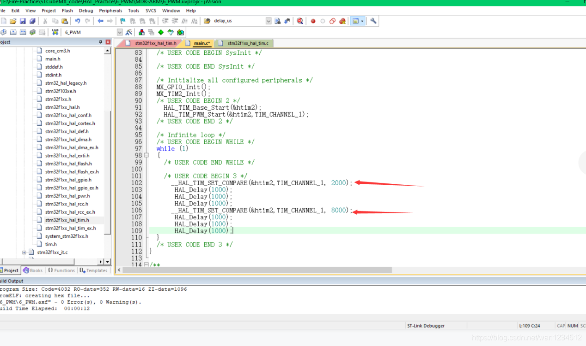

## 平台使用说明

硬件平台：正点原子STM32MINI开发板（STM32RCT6)

软件平台：STM32CubeMX （版本6.0.1） 、KEIL5（版本5.29）

## 实验说明 

实现功能：用PA0输出一个PWM波 

硬件连接： 

PA0 ->TIM2_CH1 

说明：有时候程序下载后不实现，可试着复位一下，也可在魔术棒配置中打开下载后复位。 （仅仅写了PWM配置部分，其余初始化以及工程配置未做说明）

## CubeMx配置

1、选择定时器2，时钟源选择Internal Clock,Channel1(通道1）选择PWM Generation CH1



2、选择分频系数为71，计数值为9999，则产生的PWM波周期为 （71+1）\*（9999+1）/72000000=10ms,为100Hz



3、设定初始Pulse值为5000，则初始占空比为5000/10000=50%。



4、看该通道引脚是否为你选定的引脚，如果不对，更改引脚，更改引脚后，查看之前相关配置是否变化。然后生成代码。



## 代码编写

1、先打开定时器2，此处定时器无需中断，然后打开PWM输出，即可输出PWM波



```c
HAL_TIM_Base_Start (&htim2);  
HAL_TIM_PWM_Start(&htim2,TIM_CHANNEL_1);
```

2、`__HAL_TIM_SET_COMPARE(&htim2,TIM_CHANNEL_1, 2000)`;此函数即可更改输出PWM波的占空比。 



>本博客所有文章除特别声明外，均采用 [CC BY-NC-SA 4.0](https://creativecommons.org/licenses/by-nc-sa/4.0/) 许可协议。转载请附上原文出处链接及本声明。
>
>原文链接: https://snqx-lqh.gitee.io/wiki/