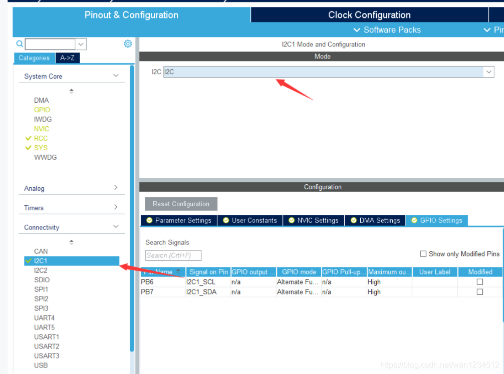
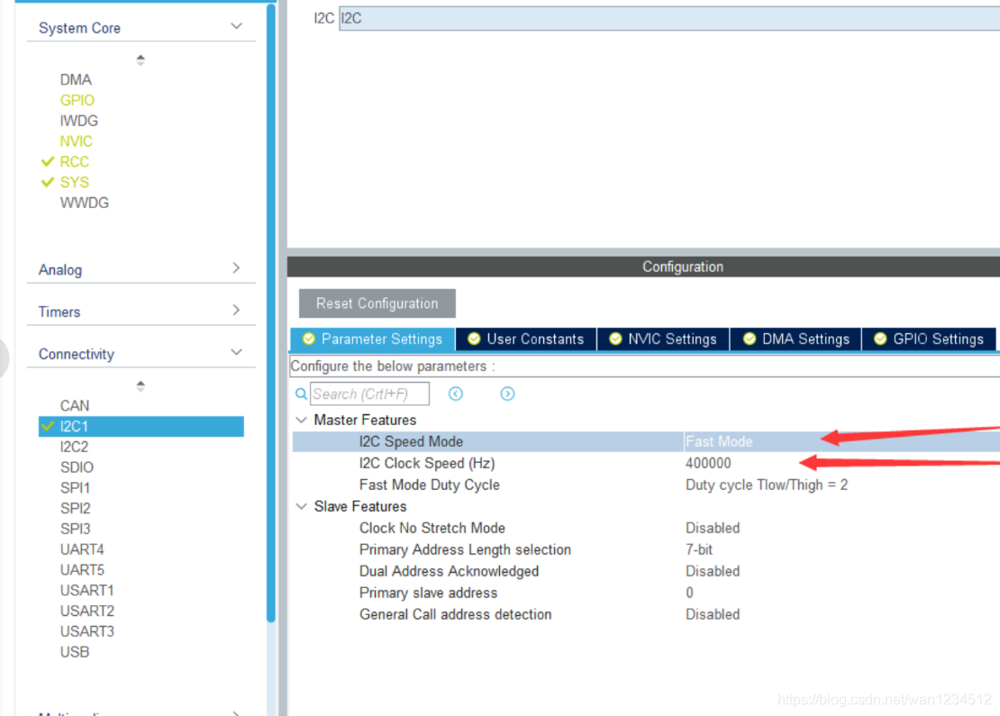
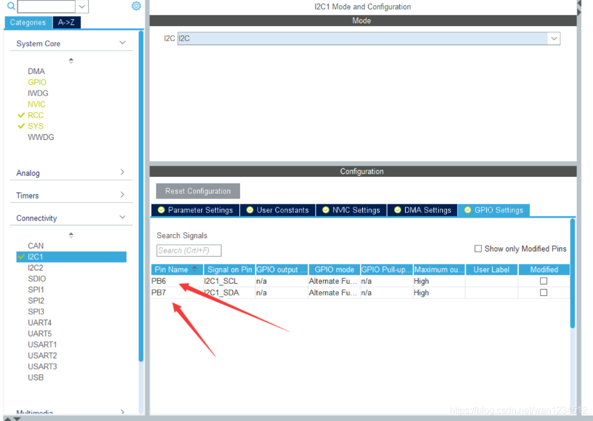
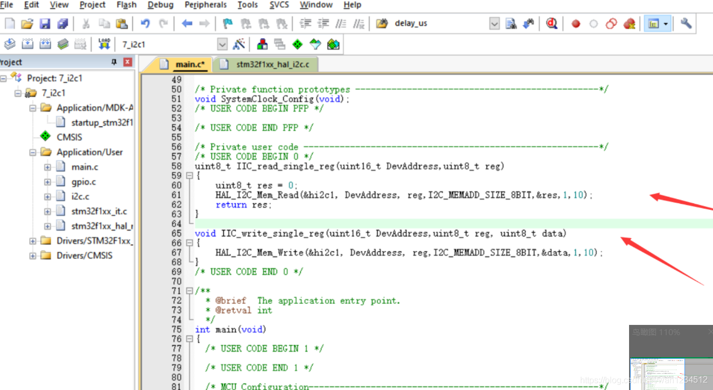
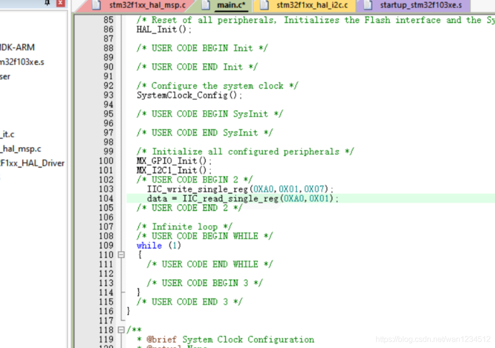

## 平台使用说明

硬件平台：正点原子STM32MINI开发板（STM32RCT6)

软件平台：STM32CubeMX （版本6.0.1） 、KEIL5（版本5.29）

## 实验说明

实现功能：用硬件IIC1读取板载EEPROM,用杜邦线连接 

硬件连接： 

PB6->IIC1_SCL 

PB7->IIC1_SDA 

PC12->EEPROM_SCL 

PC11->EEPROM_SDA 

说明：有时候程序下载后不实现，可试着复位一下，也可在魔术棒配置中打开下载后复位。 （仅仅写了IIC配置部分，其余初始化以及工程配置未做说明）

## CubeMx配置

1、在I2C1中，打开I2C模式，



2、可根据需求选择I2C速度，此处选择快速模式



3、查看想要引脚代码和实际是否对的上，然后生成代码。



## 代码编写

1、以下是IIC常用函数相关解释

```c
HAL_StatusTypeDef HAL_I2C_Mem_Read(I2C_HandleTypeDef *hi2c,  
                 uint16_t DevAddress, uint16_t MemAddress,  
                 uint16_t MemAddSize, uint8_t *pData,   
                 uint16_t Size, uint32_t Timeout)  
读取函数   
例：  
HAL_I2C_Mem_Read(&hi2c2, DevAddress, reg,I2C_MEMADD_SIZE_8BIT,&res,1,10);  
HAL_I2C_Mem_Read(&hi2c2, DevAddress, reg,I2C_MEMADD_SIZE_8BIT,buf,len,10);  
I2C_HandleTypeDef *hi2c   选择是哪个i2c  
uint16_t DevAddress      器件地址  
uint16_t MemAddress      寄存器地址  
uint16_t MemAddSize      读取单个数据字节长度  
uint8_t *pData           读取数据保存地址  
uint16_t Size            读取数据长度  
uint32_t Timeout         超时报错时间  
​  
HAL_StatusTypeDef HAL_I2C_Mem_Write(I2C_HandleTypeDef *hi2c,   
                uint16_t DevAddress, uint16_t MemAddress,   
                uint16_t MemAddSize, uint8_t *pData,   
                uint16_t Size, uint32_t Timeout)  
写入函数  
例：   
HAL_I2C_Mem_Write(&hi2c2, DevAddress, reg,I2C_MEMADD_SIZE_8BIT,&data,1,10);  
HAL_I2C_Mem_Write(&hi2c2, DevAddress, reg,I2C_MEMADD_SIZE_8BIT,data,len,10);  
I2C_HandleTypeDef *hi2c   选择是哪个i2c  
uint16_t DevAddress      器件地址  
uint16_t MemAddress      寄存器地址  
uint16_t MemAddSize      写入单个数据字节长度  
uint8_t *pData           写入数据地址  
uint16_t Size            写入数据长度  
uint32_t Timeout         超时报错时间
```

2、将函数做简单封装，这里只测试单个字节的写入和读取



```c
uint8_t IIC_read_single_reg(uint16_t DevAddress,uint8_t reg)  
{  
    uint8_t res = 0;  
    HAL_I2C_Mem_Read(&hi2c1, DevAddress, reg,I2C_MEMADD_SIZE_8BIT,&res,1,10);  
    return res;  
}  
​  
void IIC_write_single_reg(uint16_t DevAddress,uint8_t reg, uint8_t data)  
{  
    HAL_I2C_Mem_Write(&hi2c1, DevAddress, reg,I2C_MEMADD_SIZE_8BIT,&data,1,10);  
}

```

3、测试往0X01地址写数据0X07，用data读出来，用DEBUG查看，查看结果满足



```c
IIC_write_single_reg(0XA0,0X01,0X07);  
data = IIC_read_single_reg(0XA0,0X01);
```

>本博客所有文章除特别声明外，均采用 [CC BY-NC-SA 4.0](https://creativecommons.org/licenses/by-nc-sa/4.0/) 许可协议。转载请附上原文出处链接及本声明。
>
>原文链接: https://snqx-lqh.gitee.io/wiki/