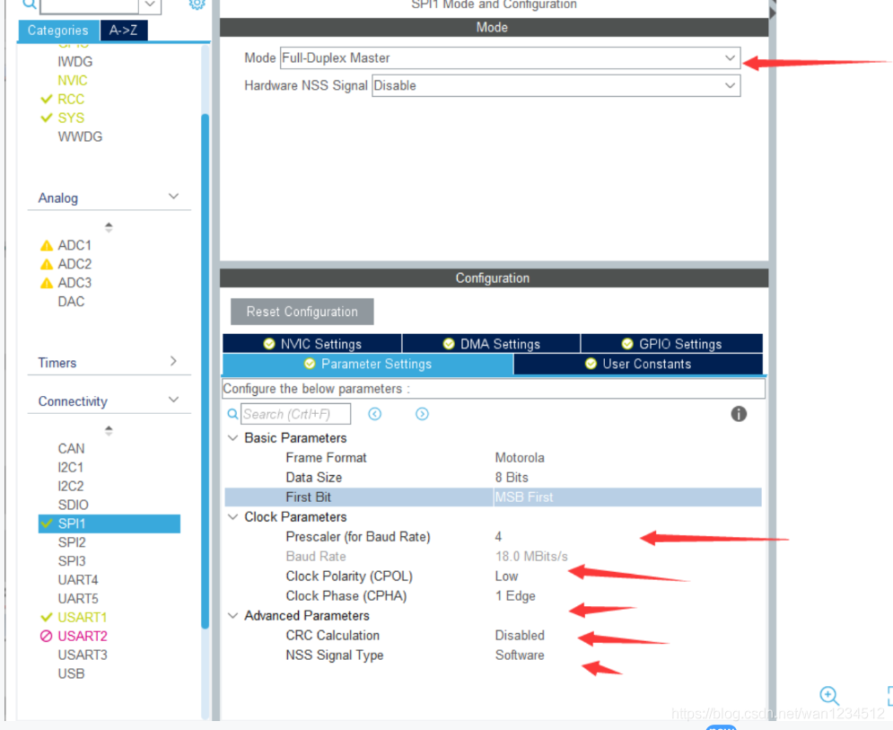
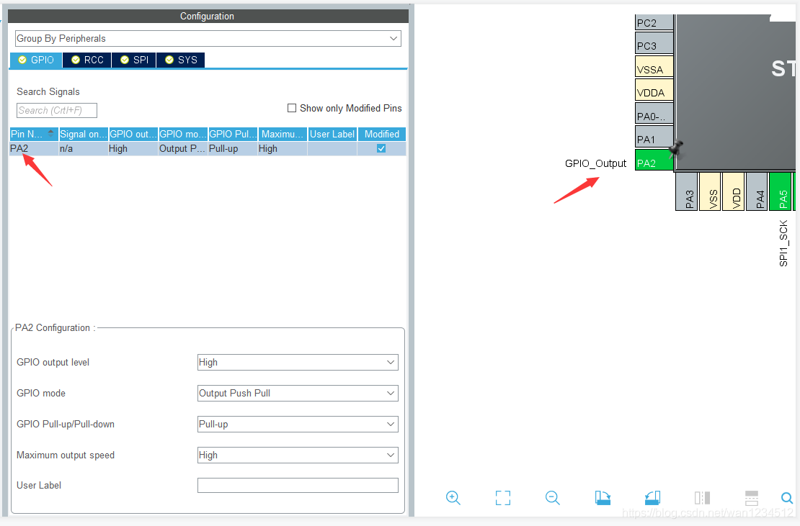

## 平台使用说明

硬件平台：正点原子STM32MINI开发板（STM32RCT6)

软件平台：STM32CubeMX （版本6.0.1） 、KEIL5（版本5.29）

## 实验说明

实现功能：用硬件SPI1读取板载W25Q64

硬件连接： 

PA5->SPI_CLK

PA6->SPI_MISO

PA7->SPI_MOSI

PA2->SPI_NSS

说明：有时候程序下载后不实现，可试着复位一下，也可在魔术棒配置中打开下载后复位。（仅仅写了SPI配置部分，其余初始化以及工程配置未做说明）

参考博客： [STM32CubeMx开发之路—13使用SPI读写W25Q64](https://blog.csdn.net/weixin_41294615/article/details/103233374)

## CubeMx 配置

1、打开SPI1，选择全双工模式，MSB先行，时钟分频任意，只要不超过18M即可，选择软件触发



2、初始化PA2，当做SPI软件触发引脚，然后配置好工程其他文件生成代码即可。



## 代码编写

以下为测试代码，有参考上面链接的博客，也有一些修改，可以放在main.c中进行测试

```c
#define SPI_NSS_HIGH();  HAL_GPIO_WritePin(GPIOA,GPIO_PIN_2,GPIO_PIN_SET);  
#define SPI_NSS_LOW();   HAL_GPIO_WritePin(GPIOA,GPIO_PIN_2,GPIO_PIN_RESET);  
#define MY_HSPI          hspi1  
​  
/* W25Q64的指令 */  
uint8_t w25x_read_id = 0x90;    // 读ID  
uint8_t m_addr[3]    = {0,0,0}; // 测试地址0x000000  
uint8_t check_addr   = 0x05;    // 检查线路是否繁忙  
uint8_t enable_write = 0x06;    // 使能了才能改变芯片数据  
uint8_t erase_addr   = 0x20;    // 擦除命令  
uint8_t write_addr   = 0x02;    // 写数据命令  
uint8_t read_addr    = 0x03;    // 读数据命令  
​  
uint8_t temp_ID[5] = {0,0,0,0,0};   // 接收缓存  
uint8_t temp_wdata[5] = {0x99,0x88,0x77,0x66,0x55}; // 需要写入的数据  
uint8_t temp_rdata[5] = {0,0,0,0,0};    // 读出数据保存的buff  
/* 读ID */  
void ReadID(void)  
{  
    SPI_NSS_LOW();                                          // 使能CS  
    HAL_SPI_Transmit(&MY_HSPI, &w25x_read_id, 1, 100);  // 读ID发送指令  
    HAL_SPI_Receive(&MY_HSPI, temp_ID, 5, 100); // 读取ID  
    SPI_NSS_HIGH();                                         // 失能CS  
}  
​  
/* 检查是否繁忙 */  
void CheckBusy(void)  
{  
    uint8_t status=1;  
    uint32_t timeCount=0;  
    do  
    {  
        timeCount++;  
        if(timeCount > 0xEFFFFFFF) //等待超时  
        {  
            return ;  
        }  
          
        SPI_NSS_LOW();                                              // 使能CS   
        HAL_SPI_Transmit(&MY_HSPI, &check_addr, 1, 100);    // 发送指令  
        HAL_SPI_Receive(&MY_HSPI, &status, 1, 100);     // 读取  
        SPI_NSS_HIGH();                                             // 失能CS  
    }while((status&0x01)==0x01);  
}  
​  
​  
/* 写入数据 */  
void WriteData(void)  
{  
    /* 检查是否繁忙 */  
    CheckBusy();  
      
    /* 写使能 */  
    SPI_NSS_LOW();                                          // 使能CS  
    HAL_SPI_Transmit(&MY_HSPI, &enable_write, 1, 100);  // 发送指令  
    SPI_NSS_HIGH();                                     // 失能CS  
      
    /* 擦除 */  
    SPI_NSS_LOW();                                          // 使能CS  
    HAL_SPI_Transmit(&MY_HSPI, &erase_addr, 1, 100);    // 发送指令  
    HAL_SPI_Transmit(&MY_HSPI, m_addr, 3, 100); // 发送地址  
    SPI_NSS_HIGH();                                     // 失能CS  
      
    /* 再次检查是否繁忙 */  
    CheckBusy();  
      
    /* 写使能 */  
    SPI_NSS_LOW();                                          // 使能CS  
    HAL_SPI_Transmit(&MY_HSPI, &enable_write, 1, 100);  // 发送指令  
    SPI_NSS_HIGH();                                     // 失能CS  
​  
    /* 写数据 */  
    SPI_NSS_LOW();                                          // 使能CS  
    HAL_SPI_Transmit(&MY_HSPI, &write_addr, 1, 100);    // 发送指令  
    HAL_SPI_Transmit(&MY_HSPI, m_addr, 3, 100); // 地址  
    HAL_SPI_Transmit(&MY_HSPI, temp_wdata, 5, 100); // 写入数据  
    SPI_NSS_HIGH();                                     // 失能CS  
}  
​  
/* 读取数据 */  
void ReadData(void)  
{  
    /* 检查是否繁忙 */  
    CheckBusy();      
      
    /* 开始读数据 */  
    SPI_NSS_LOW();                                          // 使能CS  
    HAL_SPI_Transmit(&MY_HSPI, &read_addr, 1, 100); // 读发送指令  
    HAL_SPI_Transmit(&MY_HSPI, m_addr, 3, 100); // 地址  
    HAL_SPI_Receive(&MY_HSPI,  temp_rdata, 5, 100); // 拿到数据  
    SPI_NSS_HIGH();                                     // 失能CS  
}  
​  
​  
main函数中初始化后分别执行以下代码  
ReadID();  
WriteData();  
ReadData();
```

>本博客所有文章除特别声明外，均采用 [CC BY-NC-SA 4.0](https://creativecommons.org/licenses/by-nc-sa/4.0/) 许可协议。转载请附上原文出处链接及本声明。
>
>原文链接: https://snqx-lqh.gitee.io/wiki/