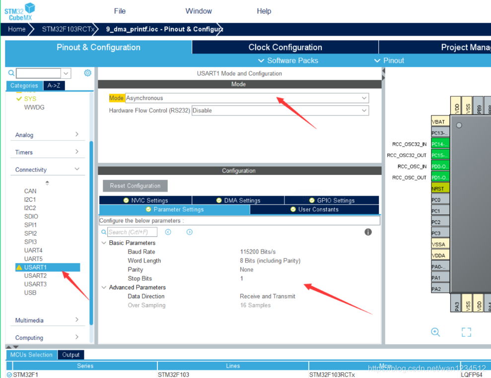
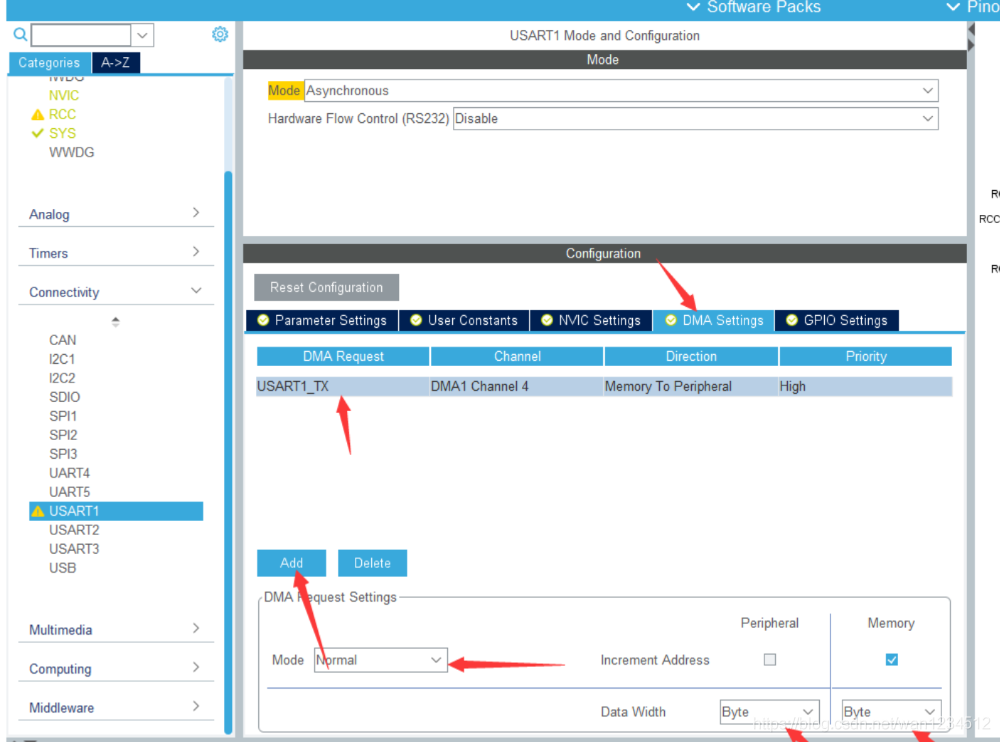
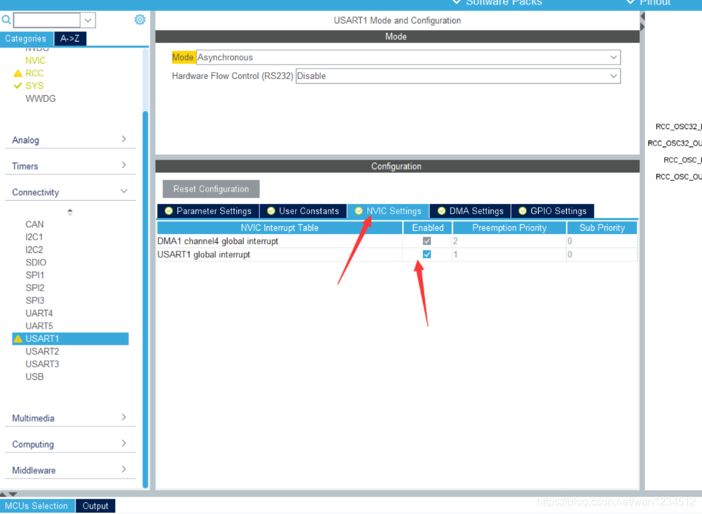
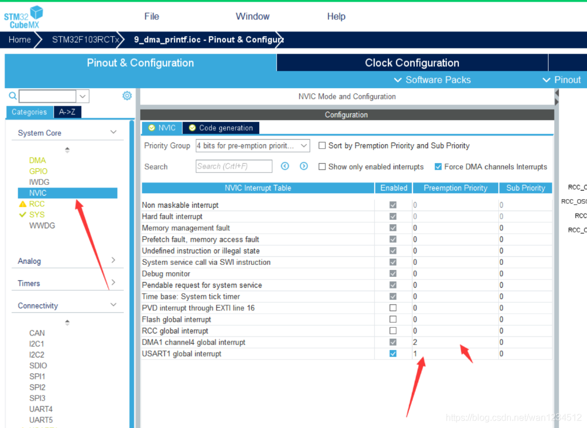
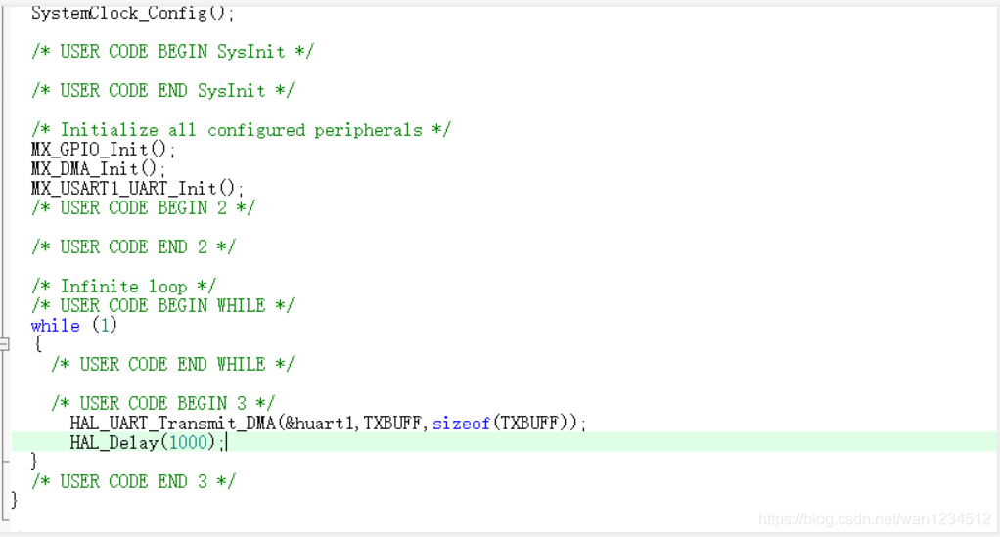

## 平台使用说明

硬件平台：正点原子STM32MINI开发板（STM32RCT6)

软件平台：STM32CubeMX （版本6.0.1） 、KEIL5（版本5.29）

## 实验说明

实现功能：用DMA将内存数据转到串口1输出寄存器，并进行输出

硬件连接： 

PA9   ->  TX

PA10 ->   RX

说明：有时候程序下载后不实现，可试着复位一下，也可在魔术棒配置中打开下载后复位。（仅仅写了DMA配置部分，其余初始化以及工程配置未做说明）

## CubeMx配置

1、先完成串口的基础配置



2、在DMA Setting中Add一个DMA，选择TX，优先级可选择High，DMA模式有循环传输和普通，这里选择普通模式，存储器自增勾上，数据宽度为Byte,字节。



3、打开中断使能。



4、NVIC中可配置优先级，然后配置好工程其他文件后生成代码。



## 代码编写

1、初始化一个数组，并将其发送。



```c
uint8_t TXBUFF[100];  
​  
int16_t i=0;  
for(i=0;i<100;i++)  
{  
    TXBUFF[i] = 'Y';  
}  
​  
while (1)  
{  
/* USER CODE END WHILE */  
​  
/* USER CODE BEGIN 3 */  
    HAL_UART_Transmit_DMA(&huart1,TXBUFF,sizeof(TXBUFF));  
    HAL_Delay(1000);  
}
```

>本博客所有文章除特别声明外，均采用 [CC BY-NC-SA 4.0](https://creativecommons.org/licenses/by-nc-sa/4.0/) 许可协议。转载请附上原文出处链接及本声明。
>
>原文链接: https://snqx-lqh.gitee.io/wiki/