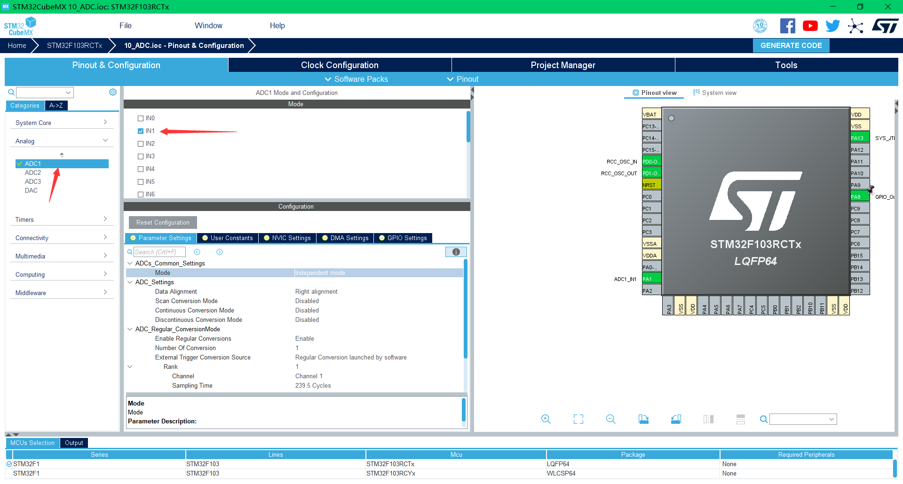
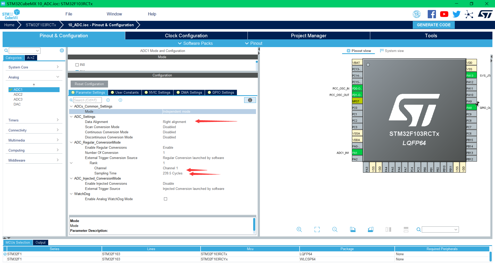

## 平台使用说明

硬件平台：正点原子STM32MINI开发板（STM32RCT6)

软件平台：STM32CubeMX （版本6.0.1） 、KEIL5（版本5.29）

## 实验说明

实现功能：用ADC1通道1采集数据

硬件连接：

PA1->ADC1通道1

说明：有时候程序下载后不实现，可试着复位一下，也可在魔术棒配置中打开下载后复位。（仅仅写了ADC配置部分，其余初始化以及工程配置未做说明）

## CubeMx配置

1、选择ADC1通道1



2、主要选择右对齐和转换时间配置。然后生成代码。



## 代码编写

以下是示例代码

```c
HAL_ADC_Start(&hadc1);  
HAL_ADC_PollForConversion(&hadc1,10);  
if(HAL_IS_BIT_SET(HAL_ADC_GetState(&hadc1), HAL_ADC_STATE_REG_EOC))  
{  
    ADC_VALUE = HAL_ADC_GetValue(&hadc1);  
}
```

>本博客所有文章除特别声明外，均采用 [CC BY-NC-SA 4.0](https://creativecommons.org/licenses/by-nc-sa/4.0/) 许可协议。转载请附上原文出处链接及本声明。
>
>原文链接: https://snqx-lqh.gitee.io/wiki/