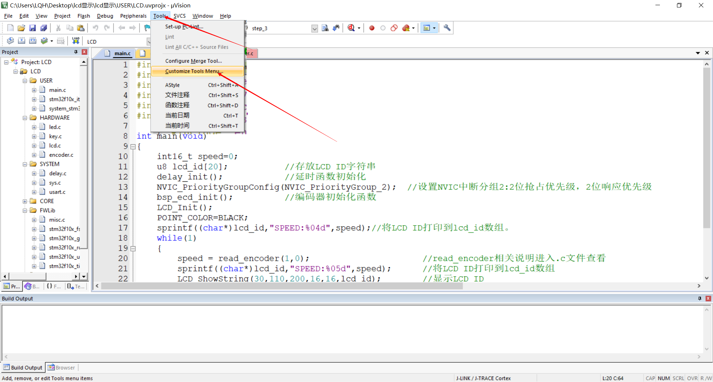
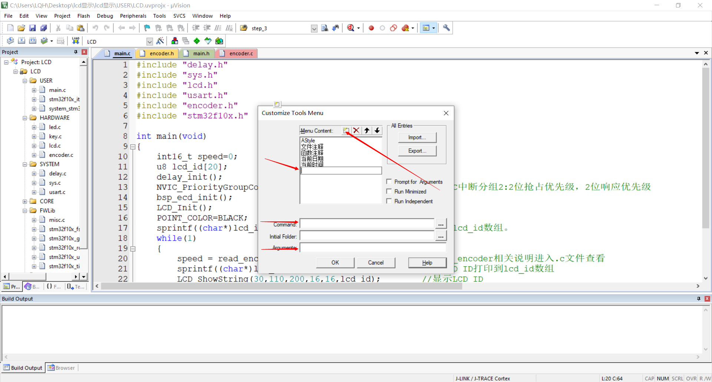
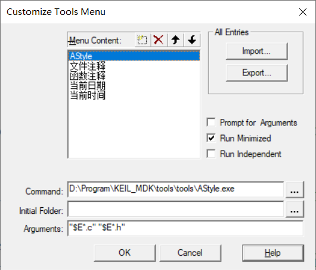
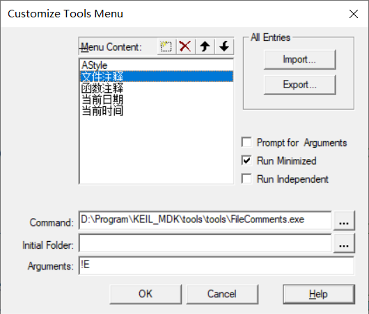
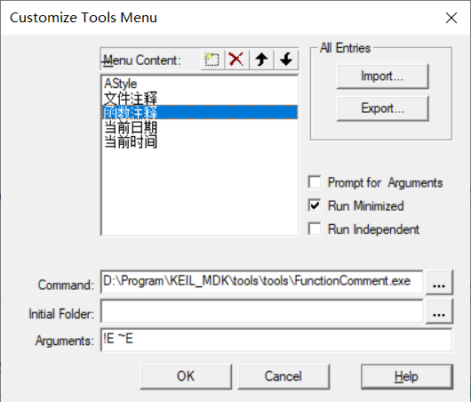
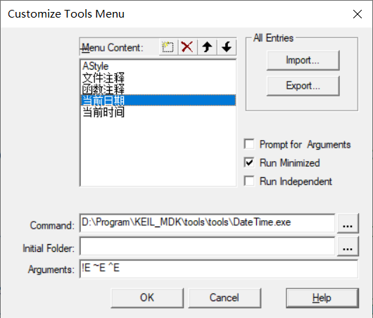
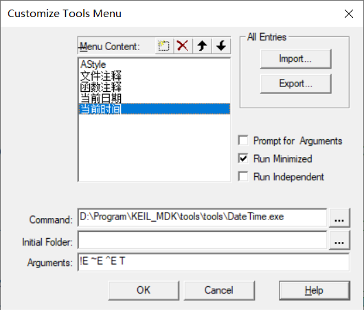
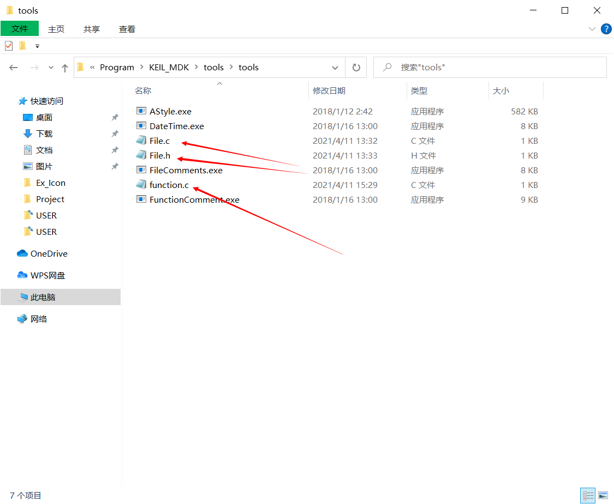

## 添加插件

选择用户自定义工具栏设置



新建一个插件名，需要选择插件路径，还有实现代码，可以根据后面几步填写，路径自己选好



## 格式化文档



```c
-n "$E*.c" "$E*.h"
```

## 文件注释



```c
!E
```

## 函数注释



```c
!E ~E
```

## 插入当前日期



```c
!E ~E ^E
```

## 插入当前时间



```c
!E ~E ^E T
```

## 修改注释文件

修改文件注释以及函数注释格式，在Tool中修改以下文件格式即可，File.c是文件注释的格式，function是函数的注释格式。



## 配置虚拟串口

下载虚拟串口软件

建立一个ini文件，放入下面的代码，COM2就是要使用的串口，S1IN代表串口1

```ini
MODE COM2 115200,0,8,1  
ASSIGN COM2 < S1IN > S1OUT
```
