## 一、JDK的安装与环境配置

1、在[java的官网下载页面](https://www.oracle.com/java/technologies/downloads/#jdk17-windows)找到安装包进行安装。找到对应的操作系统，第一个是直接下载压缩包，第二个是下载一个下载器再安装，我是直接下的第一个。

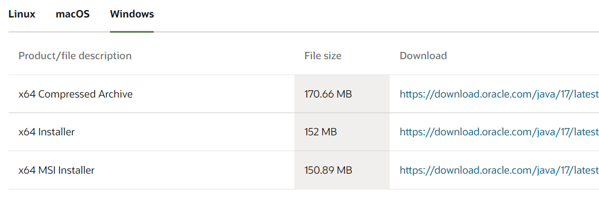

2、修改环境变量，先建立一个JAVA_HOME变量，将JDK的安装下载位置设为值。

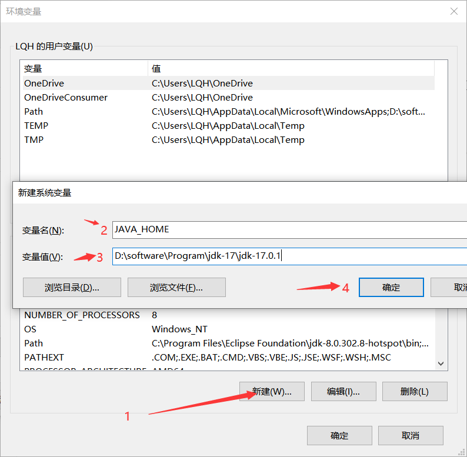

3、点击系统变量中的Path,然后点击编辑，然后把bin的路径填上。按道理来说其实填路径这一步，直接把bin的路径加到Path中也可以，但是网上好多教的都是做一个JAVA_HOME变量，我也不知道为啥。

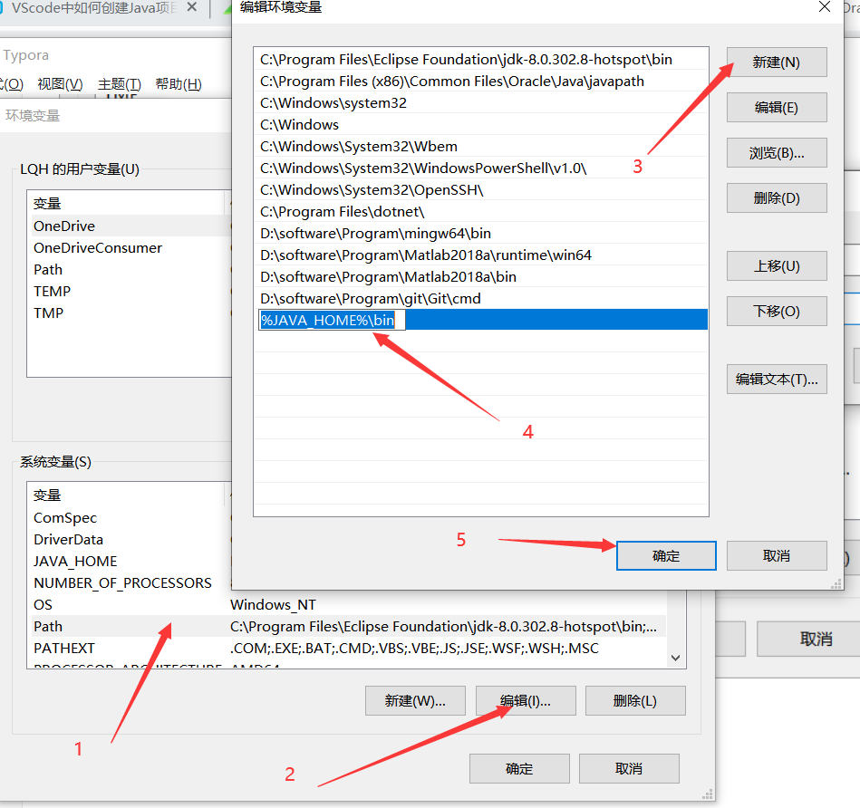

记得退出环境变量的要进行确定，不要直接叉掉。

4、打开CMD弹框，运行以下代码

```c
java -version
```

若能出现以下，一般就是安装好了，版本可能会不一样。是自己版本就行。


## 二、VScode的相关配置

1、插件下载，找到以下两个插件进行安装，第一个会将有关Java的插件装完，第二个是代码运行插件

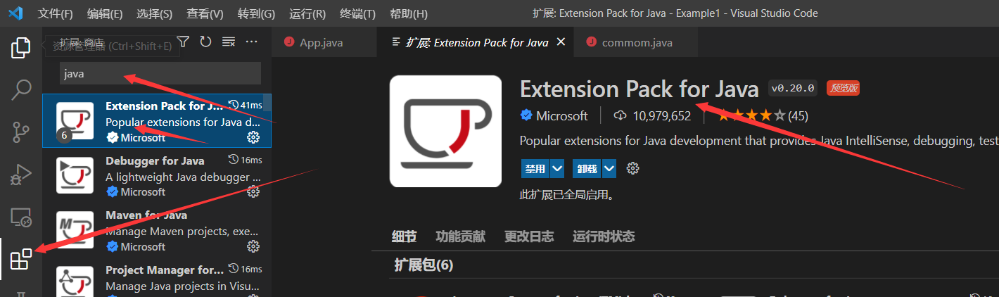

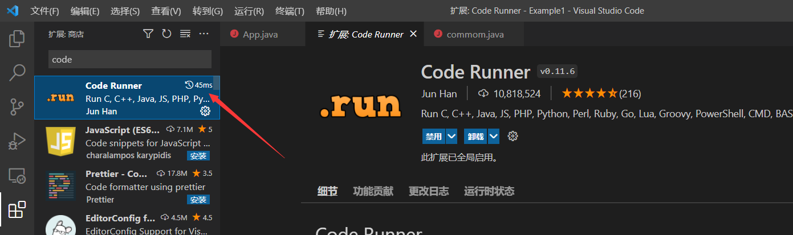

2、点击命令面板，也可以ctrl+shift+p


3、输入java，然后找到新建工程

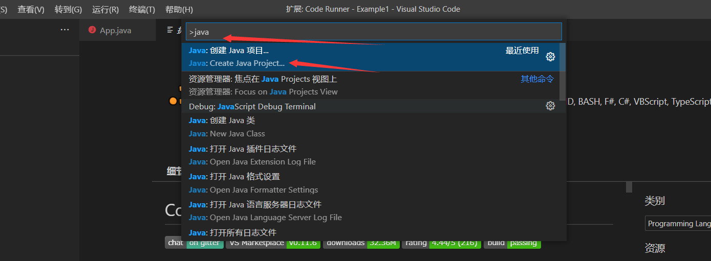

4、选择想要的工程类型，我这里选择No build tools

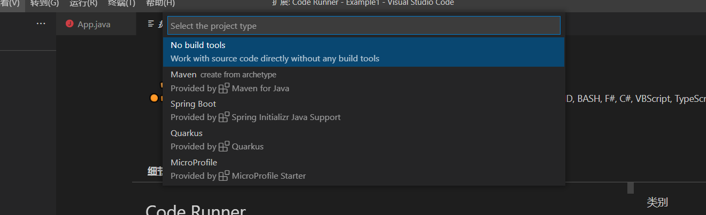

5、找一个想放置工程的文件夹

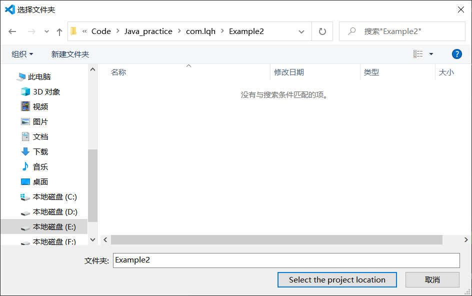

6、输入工程名

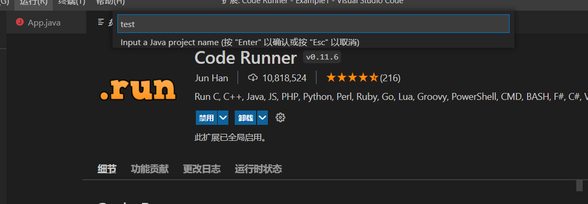

7、点开src中的App.java，然后右键Run Code，便可以执行。在输出就可以看到HelloWorld了。到这里，因该就基本可以了。

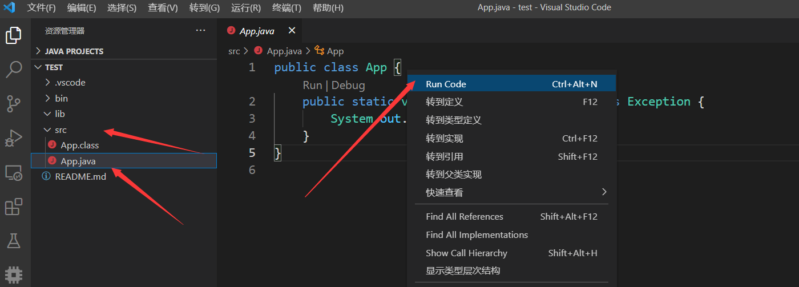

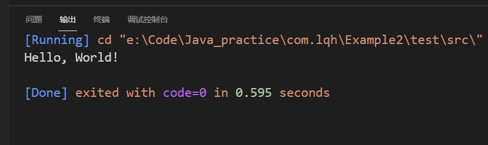

8、bin文件放置的是你使用里面工程自带的运行，class文件的保存位置，可以使用这个

​	  lib文件就是拿来放置一些外面的包的位置

​	  src就是你写的东西。

## 三、建立一个有包的操作

1、在src中新建一个文件夹，然后建立一个add.java文件，建立一个add类。

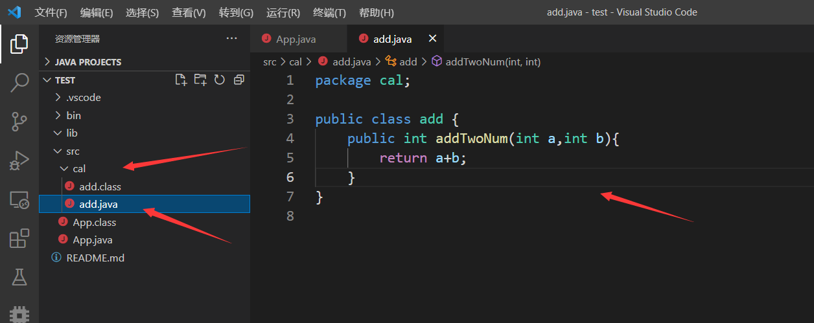

2、在App.java中进行调用

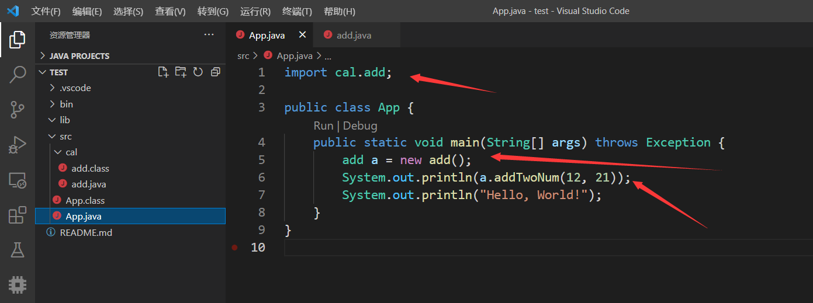

3、Run Code

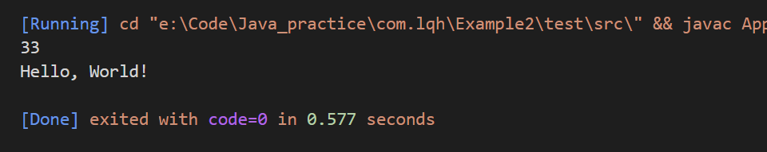

4、在左边应该还能找到一个JAVA PROJECTS的资源管理器，里面也有各个文件的分类。

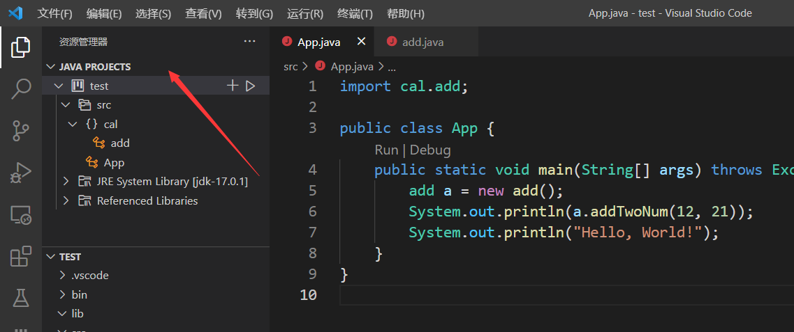

5、点击里面的运行。class文件的保存位置就会在bin目录下，src目录下就不会有，但是我这里已经用code run生成了。

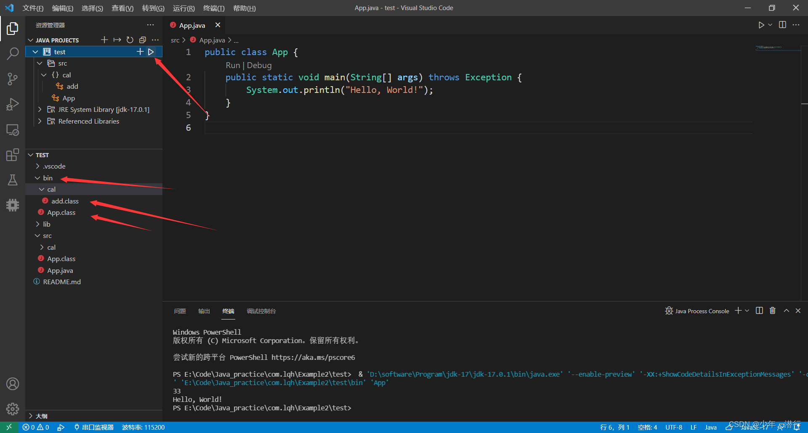
