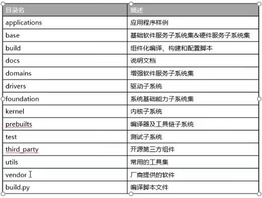
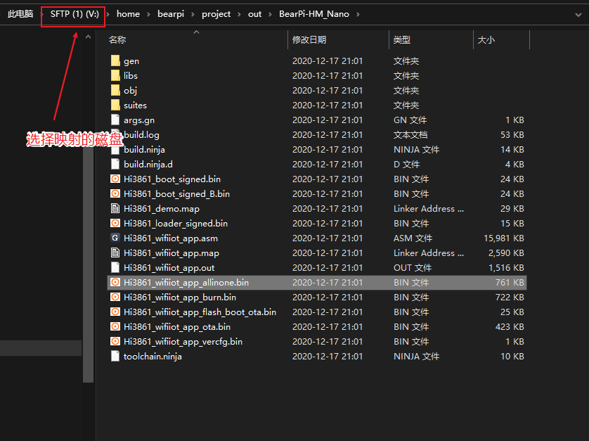

## OpenHarmonyOS（Liteos-M）使用命令行

### 1、安装相关软件

- 下载镜像（小熊派镜像，用于快速上手）下载完后，将他的VOF文件导入就可以了

- 小熊派镜像，用于快速上手，下载地址（百度云）：[https://pan.baidu.com/s/1T0Tcl3y48C1p5L6y-6HJNg](https://gitee.com/link?target=https%3A%2F%2Fpan.baidu.com%2Fs%2F1T0Tcl3y48C1p5L6y-6HJNg) 提取码：eusr 下载完后，将他的VOF文件导入就可以了
- 下载ubuntu镜像 18.04 - 22.04

- 下载HiBurn
- 下载地址（百度云）：[https://pan.baidu.com/s/1bp2ypAfH2HaNPTY2KwEhEA](https://gitee.com/link?target=https%3A%2F%2Fpan.baidu.com%2Fs%2F1bp2ypAfH2HaNPTY2KwEhEA) 提取码：1234

- 下载并安装RaiDrive工具（用于Linux文件映射到Windows中）
- 下载地址：[https://forspeed.rbread05.cn/down/newdown/5/28/RaiDrive.rar](https://gitee.com/link?target=https%3A%2F%2Fforspeed.rbread05.cn%2Fdown%2Fnewdown%2F5%2F28%2FRaiDrive.rar)

### 2、OpenHarmony环境搭建

1）将Ubuntu Shell 环境修改为 bash。选择否

```
ls -l /bin/sh
sudo dpkg-reconfigure dash
```

2）安装python环境

```
sudo apt-get install python3.8
sudo apt-get install python3-pip
sudo pip3 install setuptools
sudo pip3 install kconfiglib
sudo pip3 install pycryptodome
sudo pip3 install testresources
sudo pip3 install six --upgrade --ignore-installed six
sudo pip3 install ecdsa

#安装过程中可能会报依赖文件未安装错误，差什么就装什么

# 如果有python2和3
which python
rm /usr/bin/python
ln -s python3.8 /usr/bin/python
```

3）安装scons

```
python3 -m pip install scons
scons -v
```

4）下载gn，ninja，gcc_riscv32交叉编译工具

[https://pan.baidu.com/s/1bp2ypAfH2HaNPTY2KwEhEA](https://pan.baidu.com/s/1bp2ypAfH2HaNPTY2KwEhEA)提取码：1234

可以用ftp把下载的文件传到ubuntu里

然后将3个文件解压并拷贝到根目录下

```
tar -xvf gcc_riscv32-linux-7.3.0.tar.gz -C ~
tar -xvf gn.1523.tar -C ~
tar -xvf ninja.1.9.0.tar -C ~
```

5）配置环境变量

```
vim ~/.bashrc
将以下命令拷贝到.bashrc 文件的最后一行，保存并退出。

export PATH=~/gcc_riscv32/bin:$PATH
export PATH=~/gn:$PATH
export PATH=~/ninja:$PATH

生效环境变量。
source ~/.bashrc
Shell 命令行中输入如下命令，如果能正确显示编译器版本号，表明编译器安装成功。
riscv32-unknown-elf-gcc -v
```

6）编译可能会报prompt_toolkit

```
安装指定版本 
python3.8 -m pip uninstall prompt_toolkit
python3.8 -m pip install prompt_toolkit==1.0.15
```

7）添加软连接

```
cd /usr/bin/
which python3
ln -s /usr/bin/python3 python
python --version
```

8）官方源码需要配置hb，选择

```
pip3 install --user build/lite
vim ~/.bashrc
export PATH=~/.local/bin:$PATH
source ~/.bashrc
```

[OpenAtom OpenHarmony](https://docs.openharmony.cn/pages/v3.1/zh-cn/device-dev/quick-start/quickstart-lite-env-setup.md/)

### 3、获取源码

1）获取小熊派的源码

```
git clone https://gitee.com/bearpi/bearpi-hm_nano.git -b master
```

2）测试编译代码

```
python build.py BearPi-HM_Nano
```

3）获取官方的代码

参考连接[zh-cn/device-dev/get-code/sourcecode-acquire.md · OpenHarmony/docs - Gitee.com](https://gitee.com/openharmony/docs/blob/master/zh-cn/device-dev/get-code/sourcecode-acquire.md#https://gitee.com/link?target=https%3A%2F%2Frepo.huaweicloud.com%2Fopenharmony%2Fos%2F3.0%2Fhispark_pegasus.tar.gz)

可以从镜像站点[zh-cn/release-notes/Readme.md · OpenHarmony/docs - Gitee.com](https://gitee.com/openharmony/docs/blob/master/zh-cn/release-notes/Readme.md)直接下载源码

4）源码简介



5）小熊派的就可以后面看

[开发环境搭建(复杂)—在Windows上打开工程源码_哔哩哔哩_bilibili](https://www.bilibili.com/video/BV1tv411b7SA?p=5&spm_id_from=pageDriver&vd_source=fcf02d9420f87f9d13e80731eaba983f)
### 4、程序下载

1）在windows环境下，在Windows打开Hiburn工具，并点击Refresh，在COM中选择下载COM号。在Com settings中设置Baud为：921600，点击确定。点击 Hiburn工具中的Select file按钮，选择下面路径的文件。在弹出的文件框中并选中：Hi3861_wifiiot_app_allinone.bin 文件。



点击Connect按钮，此时Connect按钮变成Disconnect，等待下载。

复位开发板RESET按键，开始下载程序

### 5、Windows下vscode开发

安装remote-ssh连接到虚拟机，就可以进行相关开发

## OpenHarmonyOS（Liteos-M）使用IDE

### 1、基础设置

基础配置和上面命令行方法的1和2一样

### 2、Ubuntu和windows的混合开发

[OpenAtom OpenHarmony](https://docs.openharmony.cn/pages/v3.2/zh-cn/device-dev/quick-start/quickstart-ide-env-win.md/)