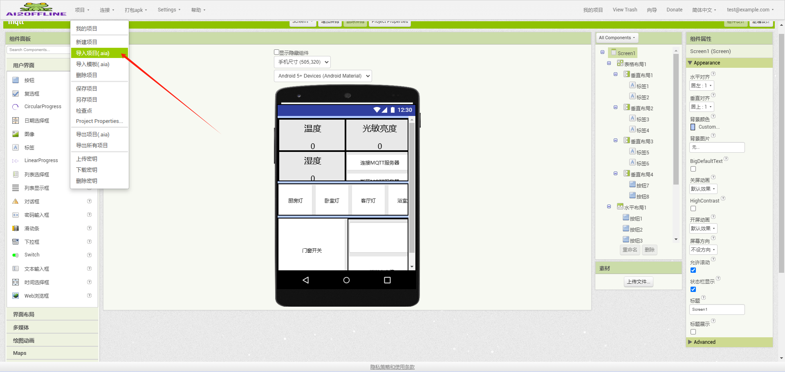
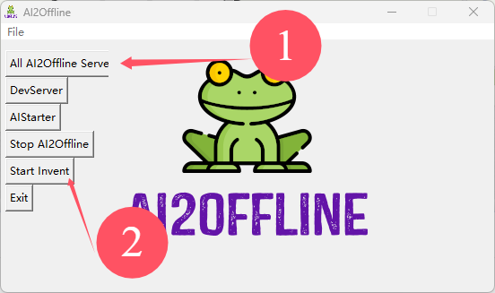

## 说明

使用APPINVENTOR搭建一个简易的APP模型。在APPINVENTOR中导入 `mqtt.aia`文件，即是创建好的工程文档。也可以自己一步步建立。

`mqtt.apk`是导出来的安卓软件。使用方式需要在连接MQTT的时候填写好每一个订阅和发布的Topic

## 安装

通过百度网盘分享的文件：appinventor
链接：https://pan.baidu.com/s/1t9kinRDX5Nv7oXTZvvY_lA 
提取码：ju6j 
--来自百度网盘超级会员V5的分享

安装完成后

以下方式启动。

其他的什么Ai伴侣暂时可以自己网上找相关资料。