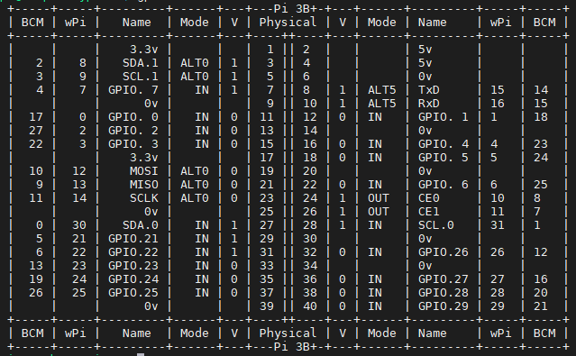

## GPIO常用编程方式和区别

树莓派的GPIO编程控制方式有使用wiringPi库、BCM2835库、RPi.GPIO库。

其中wiringPi库、BCM2835库是使用C++编程，RPi.GPIO是使用python编程方式。下面将实现这3种方式的安装和控制。

## 函数库的安装

### wiringPi

WiringPi是应用于树莓派平台的GPIO控制库函数，WiringPi中的函数类似于Arduino的Wiring系统

下载的话输入

```bash
sudo apt-get update
sudo apt-get install build-essential
git clone https://github.com/WiringPi/WiringPi.git
# 如果不出意外，你的clone应该是成功不了，你可以自己下载后，然后使用MobaXterm将文件夹传上去，我在software文件夹提供了我记笔记时的文件包，但是我的可能不是最新的。
cd WiringPi 
./build
```

然后就可以使用以下信息查看安装是否完成。

```bash
gpio -v
gpio readall
```

如果能够打印版本信息和引脚信息，即是完成了安装。



### BCM2835库

bcm2835库是树莓派cpu芯片的库函数，相当于stm32的固件库一样，底层是直接操作寄存器。而wiringPi库和python的RPi.GPIO库其底层都是通过读写linux系统的设备文件操作设备。

从BCM2835的[官网](http://www.airspayce.com/mikem/bcm2835/)下载最新的库，然后放到树莓派种解压安装，我下载的时候是1.75的版本，也会放在我的开源软件文件夹中。

```bash
tar -zxvf bcm2835-1.75.tar.gz
cd bcm2835-1.75
./configure
make
sudo make check
sudo make install
```

这样就安装完成了

### RPi.GPIO

如果是按照我之前第一节的安装步骤安装的话，他应该会默认安装RPi.GPIO，而且该固件默认的python是python3，这可能和以前部分教程说的python2不太一样，这点需要注意，如果你不是下的我上篇博客说的版本，需要自己去找教程安装python3和对应的RPi.GPIO。可以使用python测试

```bash
pi@raspberrypi:~ $ python
Python 3.11.2 (main, May  2 2024, 11:59:08) [GCC 12.2.0] on linux
Type "help", "copyright", "credits" or "license" for more information.
>>> import RPi.GPIO as GPIO
>>> GPIO.setmode(GPIO.BCM)
>>> GPIO.setup(18,GPIO.OUT)
>>> GPIO.output(18,GPIO.HIGH)
>>> GPIO.output(18,GPIO.LOW)
>>> exit()
```

应该是没问题的，我都可以通过。

## 控制GPIO口输出

首先，树莓派的GPIO口，不同的库给他的编号不同，有基本的功能名编的引脚，然后BCM库有一种编码，然后是wiringPi有一种编码。我们下面的代码将控制GPIO.1的输出高低电平的变换，他在BCM编码是18，在WiringPi是1，具体的编码对应可以看上面`gpio readall`打印的引脚信息。

### wiringPi

1、`int wiringPiSetup (void)`

返回:执行状态，-1表示失败

使用wiringPi时，你必须在执行任何操作前初始化树莓派，否则程序不能正常工作。当使用这个函数初始化树莓派引脚时，程序使用的是wiringPi 引脚编号表。引脚的编号为 0~16需要root权限

2、`int wiringPiSetupGpio (void)`

返回:执行状态，-1表示失败

当使用这个函数初始化树莓派引脚时，程序中使用的是BCM GPIO 引脚编号表。需要root权限

3、`void pinMode (int pin, int mode)`

pin：配置的引脚

mode:指定引脚的IO模式

可取的值：INPUT、OUTPUT、PWM_OUTPUT，GPIO_CLOCK

4、`void digitalWrite (int pin, int value)`

pin：控制的引脚

value：引脚输出的电平值。

可取的值：HIGH，LOW分别代表高低电平


下面就是写了一个使用wiringPi的控制0号端口高低电平变化的代码。c文件名我命名为main.c

```c
#include <wiringPi.h>

#define LED 1

int main(void)
{
    if(wiringPiSetup() < 0) 
        return 1;
    pinMode(LED,OUTPUT); //设置引脚为输出模式
    while (1)
    {
        digitalWrite(LED,1);
        delay(1000);//延时1000ms
        digitalWrite(LED,0);
        delay(1000);
    }
}
```

然后编译这段代码

```bash
cc -Wall -o main main.c -lwiringPi
```

 -Wall 表示编译时显示所有警告，-lwiringPi 表示编译时动态加载 wiringPi 库

编译完成后调用生成的main文件

```bash
sudo ./main
```

然后可以用示波器啥的，或者自己连接的LED灯在这个引脚上，就可以查看到变化。、

想要停止这个程序，`Ctrl+c`即可。

### bcm2835库

1、`int bcm2835_init (void)`

返回:执行状态，-1表示失败

当使用这个函数初始化树莓派引脚时，程序中使用的是BCM GPIO 引脚编号表。

2、`void bcm2835_gpio_fsel(uint8_t pin, uint8_t mode);`

pin：配置的引脚

mode:指定引脚的IO模式

可取的值：BCM2835_GPIO_FSEL_INPT、BCM2835_GPIO_FSEL_OUTP或者另外6个alternate function中的一个

3、`void bcm2835_gpio_write(uint8_t pin, uint8_t on);`

pin：控制的引脚

on：引脚输出的电平值。

可取的值：HIGH，LOW分别代表高低电平


bcm的引脚编号和wiringPi不同，需要注意，下面是一个实际例子

```c
#include <bcm2835.h>

#define PIN 18

int main(int argc,char **argv)
{
    if(!bcm2835_init()) //初始化BCM相关的
        return 1;

    bcm2835_gpio_fsel(PIN,BCM2835_GPIO_FSEL_OUTP); //设置为输出模式
    
    while(1)
    {
        bcm2835_gpio_write(PIN,HIGH); 
        bcm2835_delay(500);//延时500ms
        bcm2835_gpio_write(PIN,LOW);
        bcm2835_delay(500);
    }
    
    bcm2835_close();
    return 0;
}
```

然后编译这段代码

```bash
gcc -Wall main.c -o main -lbcm2835
```

 -Wall 表示编译时显示所有警告，-lbcm2835 表示编译时动态加载bcm2835 库

编译完成后调用生成的main文件

```bash
sudo ./main
```

然后可以用示波器啥的，或者自己连接的LED灯在这个引脚上，就可以查看到变化。、

想要停止这个程序，`Ctrl+c`即可。

### RPi.GPIO

直接给代码了，python应该比较好理解，具体的实现注释放在代码里面

```python
#!/usr/bin/python
# -*- coding:utf-8 -*-
import RPi.GPIO as GPIO
import time

LED = 18

GPIO.setmode(GPIO.BCM)    #采用BCM编号方式
GPIO.setup(LED,GPIO.OUT)  #设置输出模式

try:
    while True:
        GPIO.output(LED,GPIO.HIGH)
        time.sleep(1)//延时1s
        GPIO.output(LED,GPIO.LOW)
        time.sleep(1)
except:
    print("except")

GPIO.cleanup()
```

