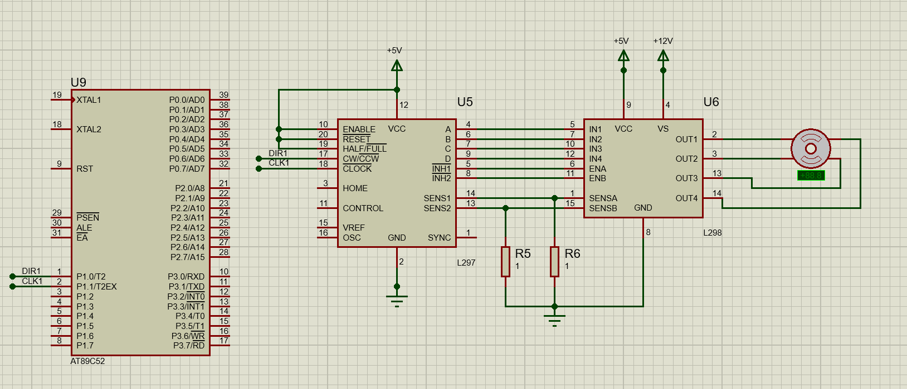

## 硬件设计

硬件使用了51单片机，L297和L298。

CW/CWW是控制电机方向，高电平正转，低电平反转。

CLOCK是时钟信号，给一个脉冲，便会有一个步进。

HALF/FULL是选择一次半步进还是全步进。假如电机步进一次90°，那么半步进就是45°。



## 软件设计

使用定时器来进行精确的定时，然后在定时器中断中改变步进电机状态。

```c
#include <reg52.h>
#include "main.h"

sbit DIR1 = P1^0;
sbit CLK1 = P1^1;

#define CW   0
#define CCW  1
#define STOP 2

u8 motorState = 0;

void Timer0Init(void)		//5毫秒@12.000MHz
{	
	TMOD = 0x01;		//设置定时器模式
	TL0  = 0x78;		//设置定时初始值
	TH0  = 0xEC;		//设置定时初始值
	TF0  = 0;		    //清除TF0标志
	TR0  = 1;		    //定时器0开始计时
	ET0  = 1;
	EA   = 1;
}

void main()
{
	Timer0Init();
	motorState = CCW;	
	while(1)
	{
	}
}

void Timer0() interrupt 1
{
	static int counts = 0;
	TL0 = 0x78;		    //设置定时初始值
	TH0 = 0xEC;		    //设置定时初始值
	counts++;
	if(counts>10)//每隔10*5*2ms电机转动一个步距
	{
		if(motorState == CW)
		{
			DIR1 = 1;
			CLK1 = !CLK1;
		}else if(motorState == CCW)
		{
			DIR1 = 0;
			CLK1 = !CLK1;
		}else
		{
			CLK1=0;
		}
		counts=0;
	}
}

```

