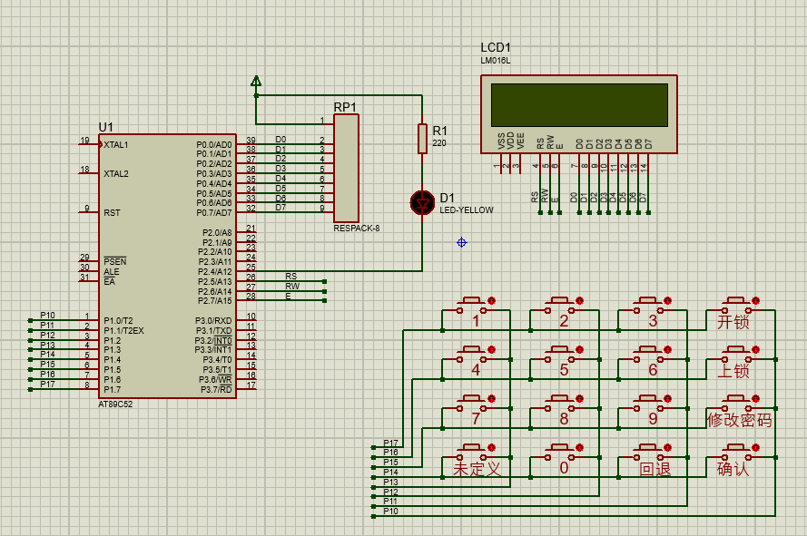
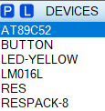

## 功能介绍

1、实现开锁、上锁、修改密码的功能。

2、初始密码666666，点击开锁后，输入密码，点击确认键，然后灯亮，示意开锁。

3、点击修改密码，需要先输入原密码点击确认后，再输入新密码点击确认，修改成功后显示成功标识。

4、点击上锁按钮上锁。

## 软件平台及代码开源

仿真软件：Proteus 8.9

代码编写：Keil5

**百度网盘链接：**

链接：https://pan.baidu.com/s/1DhzBwq-PywJVlyiuO_-AOA 
提取码：f6kg 

**Gitee链接：**

[51单片机项目学习: 这个仓库拿来保存一些51单片机项目学习 (gitee.com)](https://gitee.com/snqx-lqh/my_51_project_practice)

## 仿真硬件选型


LM016L显示提示信息，LED灯作为模拟锁，主控是89C52，使用矩阵按键。



## 代码编写

### 整体设计思路

​		在5ms定时器中进行按键扫描，获得键值，然后在主循环中实现相应键值按下后的相关功能，主要设置3个功能，开锁、上锁、修改密码，相应的按键按下后，就将对应的功能标志位置1，对应的标志位置1后，就会执行相关的功能函数。

### 软件代码设计

#### LCD显示

​		LCD初始化程序使用的是裁剪过的普中的初始化代码，显示功能函数使用的是宋学松老师手把手教你学51单片机中的代码。

```c
/**
  * @name    Lcd1602_Delay1ms
  * @brief   延时函数，延时1ms
  * @param   : [输入/出] 
  * @retval  返回值
  */
void Lcd1602_Delay1ms(unsigned int c)   //误差 0us
{
    unsigned char a,b;
	for (; c>0; c--)
	{
		 for (b=199;b>0;b--)
		 {
		  	for(a=1;a>0;a--);
		 }      
	}
    	
}
/**
  * @name    LcdWriteCom
  * @brief   向LCD写入一个字节的命令
  * @param   com
  * @retval  返回值
  */
void LcdWriteCom(unsigned char com)	  //写入命令
{
	LCD1602_E = 0;     //使能
	LCD1602_RS = 0;	   //选择发送命令
	LCD1602_RW = 0;	   //选择写入
	
	LCD1602_DATAPINS = com;     //放入命令
	Lcd1602_Delay1ms(1);		//等待数据稳定

	LCD1602_E = 1;	          //写入时序
	Lcd1602_Delay1ms(5);	  //保持时间
	LCD1602_E = 0;
}
/**
  * @name    LcdWriteData
  * @brief   向LCD写入一个字节的数据
  * @param   dat
  * @retval  返回值
  */
void LcdWriteData(unsigned char dat)			//写入数据
{
	LCD1602_E = 0;	//使能清零
	LCD1602_RS = 1;	//选择输入数据
	LCD1602_RW = 0;	//选择写入

	LCD1602_DATAPINS = dat; //写入数据
	Lcd1602_Delay1ms(1);

	LCD1602_E = 1;   //写入时序
	Lcd1602_Delay1ms(5);   //保持时间
	LCD1602_E = 0;
}	
/**
  * @name    LcdInit
  * @brief   初始化LCD屏
  * @param   无
  * @retval  返回值
  */
void LcdInit()						  //LCD初始化子程序
{
 	LcdWriteCom(0x38);  //开显示
	LcdWriteCom(0x0c);  //开显示不显示光标
	LcdWriteCom(0x06);  //写一个指针加1
	LcdWriteCom(0x01);  //清屏
	LcdWriteCom(0x80);  //设置数据指针起点
}	
/**
  * @name    LcdSetCursor
  * @brief   设置显示 RAM 起始地址，亦即光标位置，(x,y)-对应屏幕上的字符坐标
  * @param   x y
  * @retval  返回值
  */
void LcdSetCursor(unsigned char x, unsigned char y)
{
	unsigned char addr;

	if (y == 0) //由输入的屏幕坐标计算显示 RAM 的地址
		addr = 0x00 + x; //第一行字符地址从 0x00 起始
	else
		addr = 0x40 + x; //第二行字符地址从 0x40 起始
	LcdWriteCom(addr | 0x80); //设置 RAM 地址
}
/**
  * @name    LcdShowStr
  * @brief   在液晶上显示字符串，(x,y)-对应屏幕上的起始坐标，str-字符串指针
  * @param   x y str
  * @retval  返回值
  */
void LcdShowStr(unsigned char x, unsigned char y, unsigned char *str)
{
	LcdSetCursor(x, y); //设置起始地址
	while (*str != '\0') //连续写入字符串数据，直到检测到结束符
	{
		LcdWriteData(*str++); //先取 str 指向的数据，然后 str 自加 1
	}
}
```

#### 矩阵按键扫描函数

​		按键扫描函数也是参考的普中的代码，但是他是用的delay延时，但是我是将按键扫描函数放置在5ms的定时器中断服务函数中，所以使用的是计数延时的方法，现在这个函数，按键按下后，会一直保持那个键值，按键抬起后，键值才会清零，如果想实现单次触发，需要在使用的时候，手动将键值清零，便可以实现单次按键了，不清零就实现的长按。	

```c
/**
  * @name    KeyScan
  * @brief   按键检测函数
  * @param   : [输入/出] 
  * @retval  返回值
  */
void KeyScan(void)
{
    static u8 count = 0;
	GPIO_KEY=0x0f;
	if(GPIO_KEY!=0x0f && KeyState == 0)
	{
        count ++;
		if(GPIO_KEY!=0x0f && count > 2 && KeyState == 0)
		{
            count = 0;
			KeyState = 1;
			//列
			GPIO_KEY=0X0F;
			switch(GPIO_KEY)
			{
				case(0X07):	KeyValue=1;break;
				case(0X0b):	KeyValue=2;break;
				case(0X0d): KeyValue=3;break;
				case(0X0e):	KeyValue=4;break;
			}
			//行
			GPIO_KEY=0XF0;
			switch(GPIO_KEY)
			{
				case(0X70):	KeyValue=KeyValue;break;
				case(0Xb0):	KeyValue=KeyValue+4;break;
				case(0Xd0): KeyValue=KeyValue+8;break;
				case(0Xe0):	KeyValue=KeyValue+12;break;
			}
		}
	}else if(GPIO_KEY==0x0F && KeyState == 1)
    {
        KeyState = 0;
        KeyValue = 0;
    }
}
```

实现单次检测的方案，这样写就能够只使用一次按键按下的键值

```c
void KeyDownFunction()
{
    u8 KeyValueTemp = 0;
    if(KeyState == 1)
    {
        KeyValueTemp = KeyValue;//用变量保存按下的键值
        if(KeyValue != 0)//实现单次检测按键
            KeyValue = 0;
        //功能代码 
        
    }
}
```

#### 按键按下的功能函数

​		按键按下后，如果是开锁键，那就打开开锁的功能代码块，关锁和修改密码同理。

```c
void KeyDownFunction()
{
    u8 KeyValueTemp = 0;
    if(KeyState == 1)
    {
        KeyValueTemp = KeyValue;
        if(KeyValue != 0)//实现单次检测按键
            KeyValue = 0;
        if(KeyValueTemp == KEY_Open && OpenFlag == 0)//使能开锁功能函数
        {
            OpenFlag   = 1;
        }else if(KeyValueTemp == KEY_Close && CloseFlag == 0)//使能关锁功能函数
        {
            CloseFlag  = 1;
        }else if(KeyValueTemp == KEY_Change && ChangeFlag == 0)//使能修改密码功能函数
        {
            ChangeFlag = 1;
        }
        if(OpenFlag == 1)//开锁功能使能
        {  
            OpenLock(KeyValueTemp);
        }
        if(CloseFlag == 1)//关锁功能使能
        {
            sprintf((char*)DisBuff,"----  lock  ----");
            LcdShowStr(0,1,DisBuff);
            CloseFlag = 0;
            LED = 1;
        }
        if(ChangeFlag == 1)//修改密码功能使能
        {
            ChangePassword(KeyValueTemp);
        }
    }
}
```

#### 开锁功能

​		由于想要实现不影响其他代码段的功能，没有使用机器周期延时，或者while等循环输入，这部分就是实现的开锁，详细可以看代码注释。大致思路是，会有一个OpenCount计数器，点击开锁按钮后，计数器值是0，就只是进入输密码的界面，同时将计数值加1，那下一次执行到该函数就会进入修改密码的代码段。

​		在修改密码的代码段，正常的话就是修改密码，OpenCount加1，就是下一位密码修改，但是如果点击了回退按钮，就会将OpenCount减1，回退到上一个位置，同时将该位密码清空。

​		如果想要在输入密码的时候显示 * 号，那么只需让DisBuff[OpenCount+5]的值一直是 * 就可以了。

```c
void OpenLock(u8 KeyValueTemp)
{
    static u8 OpenCount = 0;
    static u8 PasswordTemp[7] = {0};
    if(OpenCount == 0)//一个计数器，为0时，就是刚进入开锁状态的时候，显示pwd :字符串
    {
        sprintf((char*)DisBuff,"pwd :           ");
        LcdShowStr(0,1,DisBuff);
        OpenCount++;//显示完后把计数器加一
    }else//下次点击就进入else
    {
        if(KeyValueTemp == KEY_Back && OpenCount > 1)//当点击回退按钮
        {
            OpenCount --;//回到上一个密码数的位置
            DisBuff[OpenCount+5] = ' ';//将显示位清空
            PasswordTemp[OpenCount-1] = 0;//将该位密码置0，因为密码使用的字符串，一般ASCLL不会为0
            LcdShowStr(0,1,DisBuff);
        }else if(OpenCount < 7)//密码设定为6位，所以6位输完后就不进入输密码的功能块了
        {
            /*
                这里有个KeyValueTable是因为按键按下的值不是实际我排版的值，所以用数组做了一次转换
            */
            DisBuff[OpenCount+5] = '0' + KeyValueTable[KeyValueTemp-1];//将显示位显示输入的数值
            PasswordTemp[OpenCount-1] = '0' + KeyValueTable[KeyValueTemp-1];//将输入的数值保存
            LcdShowStr(0,1,DisBuff);
            OpenCount++;//该位处理完后进到下一位
        }
    }
    if(OpenCount > 6 && KeyValueTemp == KEY_Confirm)//6位密码输完，又点击了确认按钮的话，就开始比较密码
    {
        OpenFlag  = 0;
        OpenCount = 0;
        if(strcmp(Password,PasswordTemp)==0)
        {
            sprintf((char*)DisBuff,"----  open  ----");
            LcdShowStr(0,1,DisBuff);
            LED = 0;
        }else
        {
            sprintf((char*)DisBuff,"----  lock  ----");
            LcdShowStr(0,1,DisBuff);
            LED = 1;
        }
    }
}
```

#### 修改密码功能

​		这是修改密码，原理大概和开锁功能差不多。就是多了个ChangeMode，该变量为0是输入旧密码，为1是输入新密码。大致的思路差不多。

```c
void ChangePassword(u8 KeyValueTemp)
{
    static u8 ChangeCount = 0;
    static u8 ChangeMode  = 0;//0是输入旧密码，1是输入新密码
    static u8 PasswordTemp[7] = {0};
    static u8 NewPasswordTemp[7] = {0};
    if(ChangeMode == 0)
    {
        if(ChangeCount == 0)//一个计数器，为0时，就是刚进入修改密码状态的时候，显示pwd :字符串
        {
            sprintf((char*)DisBuff,"pwd :           ");
            LcdShowStr(0,1,DisBuff);
            ChangeCount++;//显示完后把计数器加一
        }else//下次点击就进入else
        {
            if(KeyValueTemp == KEY_Back && ChangeCount > 1)//当点击回退按钮
            {
                ChangeCount --;//回到上一个密码数的位置
                DisBuff[ChangeCount+5] = ' ';//将显示位清空
                PasswordTemp[ChangeCount-1] = 0;//将该位密码置0，因为密码使用的字符串，一般ASCLL不会为0
                LcdShowStr(0,1,DisBuff);
            }else if(ChangeCount < 7)//密码设定为6位，所以6位输完后就不进入输密码的功能块了
            {
                /*
                    这里有个KeyValueTable是因为按键按下的值不是实际我排版的值，所以用数组做了一次转换
                */
                DisBuff[ChangeCount+5] = '0' + KeyValueTable[KeyValueTemp-1];//将显示位显示输入的数值
                PasswordTemp[ChangeCount-1] = '0' + KeyValueTable[KeyValueTemp-1];//将输入的数值保存
                LcdShowStr(0,1,DisBuff);
                ChangeCount++;//该位处理完后进到下一位
            }
        }
        if(ChangeCount > 6 && KeyValueTemp == KEY_Confirm)//6位密码输完，又点击了确认按钮的话，就开始比较密码
        {
            ChangeCount = 0;
            if(strcmp(Password,PasswordTemp)==0)//密码正确就可以输入新密码了
            {
                sprintf((char*)DisBuff,"new :           ");
                LcdShowStr(0,1,DisBuff);
                ChangeCount ++;
                ChangeMode = 1;
            }else
            {
                ChangeFlag  = 0;
                sprintf((char*)DisBuff,"----  lock  ----");
                LcdShowStr(0,1,DisBuff);
                LED = 1;
            }
        }
    }else if(ChangeMode == 1)
    {
        if(KeyValueTemp == KEY_Back && ChangeCount > 1)//当点击回退按钮
        {
            ChangeCount --;//回到上一个密码数的位置
            DisBuff[ChangeCount+5] = ' ';//将显示位清空
            NewPasswordTemp[ChangeCount-1] = 0;//将该位密码置0，因为密码使用的字符串，一般ASCLL不会为0
            LcdShowStr(0,1,DisBuff);
        }else if(ChangeCount < 7)//密码设定为6位，所以6位输完后就不进入输密码的功能块了
        {
            /*
                这里有个KeyValueTable是因为按键按下的值不是实际我排版的值，所以用数组做了一次转换
            */
            DisBuff[ChangeCount+5] = '0' + KeyValueTable[KeyValueTemp-1];//将显示位显示输入的数值
            NewPasswordTemp[ChangeCount-1] = '0' + KeyValueTable[KeyValueTemp-1];//将输入的数值保存
            LcdShowStr(0,1,DisBuff);
            ChangeCount++;//该位处理完后进到下一位
        }
        if(ChangeCount > 6 && KeyValueTemp == KEY_Confirm)//6位密码输完，又点击了确认按钮的话，就开始比较密码
        {
            ChangeFlag  = 0;
            ChangeCount = 0;
            sprintf((char*)DisBuff,"---- success----");
            LcdShowStr(0,1,DisBuff);
            ChangeMode = 0;
            strcpy(Password,NewPasswordTemp);
        }
    }
}
```

## 总结

​		这个设计功能比较简单，也有些地方功能不全，后面更新，欢迎交流。