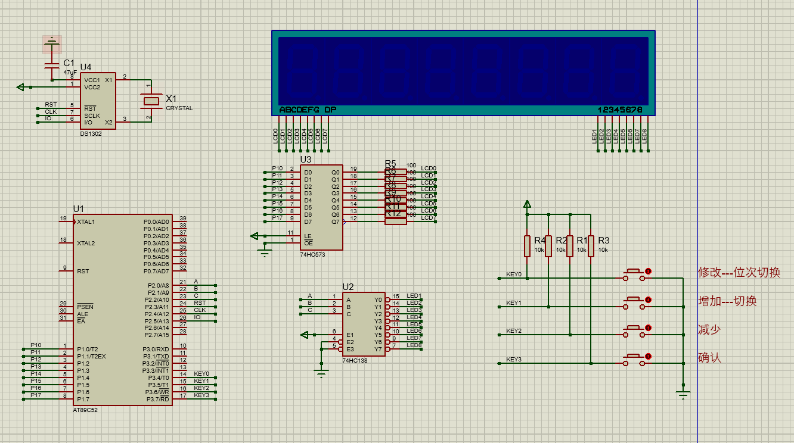
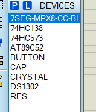

## 功能介绍

1、从DS1302中读取时间显示

2、一共4个按键，按键1按下进入修改时间模式，再按下切换修改的时间变量，这个时候第2和3个按键就是修改时间变量的按键，修改完毕后，点击按键4确认修改

3、不是修改模式下，按下按键2，可以切换时间和日期的显示

4、修改模式下，对应修改的时间变量会闪烁

## 软件平台及代码开源

仿真软件：Proteus 8.9

代码编写：Keil5

百度网盘链接：
链接：[https://pan.baidu.com/s/1RP_8MkZIqHt7WFPc6na3sQ](https://pan.baidu.com/s/1RP_8MkZIqHt7WFPc6na3sQ)
提取码：y2fn

Gitee链接：
[51单片机项目学习: 这个仓库拿来保存一些51单片机项目学习 (gitee.com)](https://gitee.com/snqx-lqh/my_51_project_practice)

## 仿真硬件选型



DS1302获取当前时间，8位共阴极数码管，74HC138作位选，74HC573作段选，4个按键。



## 代码编写

### 整体设计思路

从DS1302中读取出当前时间显示，在修改时间的时候，先把当前时间存入一篇缓存中，然后修改缓存中的数据，等到修改完毕后，再把缓存中的数据写入DS1302中。

### 软件代码设计

#### 数码管显示

数码管的显示将放置在一个5ms的定时器中实现，每隔5ms，换一个显示的位次，通过74HC138的编码来达到显示位的改变。segCode就是存放的数码管段码，缓存，segBuff的实际值为多少，就是谁的段码，如果值为10，我设置的segCode为0x00，即为不显示。

```c
void SegShow()
{
	static u8 segSelectCount = 0;//位选变量
	
	segSelectCount ++;
	if(segSelectCount > 7)
		segSelectCount = 0;

	SEG = 0x00;//消隐
	switch (segSelectCount)
	{
		case 0: HCC = 0;HCB = 0;HCA = 0;SEG = segCode[segBuff[0]];break;
		case 1: HCC = 0;HCB = 0;HCA = 1;SEG = segCode[segBuff[1]];break;
		case 2: HCC = 0;HCB = 1;HCA = 0;SEG = 0x40               ;break;
		case 3: HCC = 0;HCB = 1;HCA = 1;SEG = segCode[segBuff[2]];break;
		case 4: HCC = 1;HCB = 0;HCA = 0;SEG = segCode[segBuff[3]];break;
		case 5: HCC = 1;HCB = 0;HCA = 1;SEG = 0x40               ;break;
		case 6: HCC = 1;HCB = 1;HCA = 0;SEG = segCode[segBuff[4]];break;
		case 7: HCC = 1;HCB = 1;HCA = 1;SEG = segCode[segBuff[5]];break;
		default:HCC = 0;HCB = 0;HCA = 0;SEG = segCode[segBuff[0]];break;
	}
}
```

#### DS1302中数据的处理

往DS1302寄存器中写值

```c
void ds1302write(u8 addre,u8 dat)
{
	u8 i;
	RST=0;
	_nop_();
	SCK=0;
	_nop_();
	RST=1;
	_nop_();
	for (i=0;i<8;i++)
	{
		IO=addre&0x01;
		addre>>=1;
		SCK=1;
		_nop_();
		SCK=0;
		_nop_();
	}
	for (i=0;i<8;i++)
	{
		IO=dat&0x01;
		dat>>=1;
		SCK=1;
		_nop_();
		SCK=0;
		_nop_();
	}
	RST=0;
}
```

从DS1302中读值

```c
u8 ds1302read(u8 addre)
{
	u8 i,dat1,dat;
	RST=0;
	_nop_();
	SCK=0;
	_nop_();
	RST=1;
	_nop_();
	for (i=0;i<8;i++)
	{
		IO=addre&0x01;
		addre>>=1;
		SCK=1;
		_nop_();
		SCK=0;
		_nop_();
	}
	_nop_();
	for (i=0;i<8;i++)
	{
		dat1=IO;
		dat=(dat>>1)|(dat1<<7);
		SCK=1;
		_nop_();
		SCK=0;
		_nop_();
	}
	RST=0;
	_nop_();
	SCK=1;
	_nop_();
	IO=1;
	_nop_();
	IO=0;
	_nop_();
	return dat;
}
```

DS1302的初始化，如果在文件开头定义的FIRST_WRITE的值为1，那么在初始化的时候就会往DS1302中写入time[]中设置的时间，在第一次写入可以将这块代码打开，后面就可以关闭。

```c
void ds1302init()
{
#if FIRST_WRITE == 1
	u8 i;
	ds1302write(0x8e,0x00);
	for (i=0;i<7;i++)
	{
		ds1302write(writeaddre[i],time[i]);
	}
	ds1302write(0x8e,0x80);
#endif
}
```

DS1302读取时间,将数据从DS1302寄存器中读取出来，然后再做一个BCD码转10进制的转换。

```c
void ds1302readtime()
{
	u8 i;
	for (i=0;i<7;i++)
	{
		time[i]=ds1302read(readaddre[i]);
	}
	second = (time[0]/16)*10+(time[0]&0x0f);
	minute = (time[1]/16)*10+(time[1]&0x0f);
	hour   = (time[2]/16)*10+(time[2]&0x0f);
	day    = (time[3]/16)*10+(time[3]&0x0f);
	month  = (time[4]/16)*10+(time[4]&0x0f);
	week   = (time[5]/16)*10+(time[5]&0x0f);
	year   = (time[6]/16)*10+(time[6]&0x0f);
}
```

DS1302写入时间，将要写入的变量先做10进制转BCD码，然后写入相应的寄存器。

```c
void ds1302writetime()
{
	u8 i;
	ds1302write(0x8e,0x00);
	time[0] = (((secondTemp/10)<<4) + (secondTemp%10));
	time[1] = (((minuteTemp/10)<<4) + (minuteTemp%10));
	time[2] = (((hourTemp/10)<<4)   + (hourTemp%10));
	time[3] = (((dayTemp/10)<<4)    + (dayTemp%10));
	time[4] = (((monthTemp/10)<<4)  + (monthTemp%10));
	time[5] = (((weekTemp/10)<<4)   + (weekTemp%10));
	time[6] = (((yearTemp/10)<<4)   + (yearTemp%10));
	
	for (i=0;i<7;i++)
	{
		ds1302write(writeaddre[i],time[i]);
	}
	ds1302write(0x8e,0x80);
}
```

#### 按键扫描

按键扫描参考正点原子的写法，但是我的延时不是按照他的用delay延时，而是使用的定时器延时，这样的好处是延时时不占用CPU资源。

```c
void KeyScan(u8 mode)
{
    static int keyCount = 0;
    static int keyState = 0;
    if(mode == 1) keyState=0;
    if (keyState == 0 && (KEY0 == 0||KEY1 == 0||KEY2 == 0||KEY3 == 0))
    {
        keyCount++;
        if(keyCount>2)
        {
            keyState = 1;
            keyCount=0;
            if(KEY0 == 0) isKey0 = 1;
            else if(KEY1 == 0) isKey1 = 1;
			else if(KEY2 == 0) isKey2 = 1;
			else if(KEY3 == 0) isKey3 = 1;
        }
    } else if (KEY0 == 1 && KEY1 == 1 && KEY2 == 1 && KEY3 == 1)
    {
        keyState = 0;
    }
}
```

#### 根据显示模式修改显示变量

根据显示状态变量，修改现在的显示变量

```c
void SegBuffChange()
{
	if(showMode == 0)
	{
		segBuff[5] = second%10;
		segBuff[4] = second/10;
		segBuff[3] = minute%10;
		segBuff[2] = minute/10;
		segBuff[1] = hour%10;
		segBuff[0] = hour/10;
	}else if(showMode == 1)
	{
		segBuff[5] = day%10;
		segBuff[4] = day/10;
		segBuff[3] = month%10;
		segBuff[2] = month/10;
		segBuff[1] = year%10;
		segBuff[0] = year/10;
	}else if(showMode == 2)
	{
		segBuff[5] = secondTemp%10;
		segBuff[4] = secondTemp/10;
		segBuff[3] = minuteTemp%10;
		segBuff[2] = minuteTemp/10;
		segBuff[1] = hourTemp%10;
		segBuff[0] = hourTemp/10;
	}else if(showMode == 3)
	{
		segBuff[5] = dayTemp%10;
		segBuff[4] = dayTemp/10;
		segBuff[3] = monthTemp%10;
		segBuff[2] = monthTemp/10;
		segBuff[1] = yearTemp%10;
		segBuff[0] = yearTemp/10;
	}
}
```

#### 闪烁函数

在按键修改模式下，将闪烁状态值置1，由于该函数放置在segBuff修改的后面，所以在实际显示前，会以这里改变的为实际显示，就可以达到一个闪烁的效果。

```c
void dataBlink()
{
	static u8  blinkCount = 0;
	static bit blinkState = 0;
	if(changeOrNormalState == 1)//在按键修改模式下
	{
		blinkCount++;
		if(blinkCount == 80)//每隔80*5 闪烁状态值转换
		{
			blinkState = !blinkState;
			blinkCount = 0;
		}
	}else
	{
		blinkState = 0;
	}
	if(blinkState == 1)//假如闪烁状态值为1，该位次变量数码管不显示，我在seg.c中有定义，10就是不显示
	{
		segBuff[(2-changeCount%3)*2+1] = 10;
		segBuff[(2-changeCount%3)*2]   = 10;
	}
}
```

#### 按键执行函数

按键按下后的执行函数,可以看代码注释

```c
void ClockChangeFunction()
{
	if(isKey0 == 1)
	{
		isKey0 = 0;
		if(changeCount == 0 && changeOrNormalState == 0)//修改的位选为0，即为秒，同时显示状态为正常显示状态下
		{
			changeOrNormalState = 1;//显示状态改为修改时间模式
			DataTempGet();//获取修改前的时间变量值
			showMode = 2;//显示模式为显示修改时间下的时分秒
		}else if(changeOrNormalState == 1)//假如为显示模式
		{
			changeCount++;//按键按下位次++
			if(changeCount > 5)
				changeCount = 0;
			if(changeCount > 2)//时分秒是0、1、2，大于2就要换成年月日显示
				showMode = 3;//显示模式为显示修改时间下的年月日
			else
				showMode = 2;
		}
	}else if(isKey1 == 1)
	{
		isKey1 = 0;
		if(changeOrNormalState == 1)//显示状态为修改时间模式
		{
			dataAdd();//对应位次时间变量增加
		}else //正常显示模式
		{
			if(showMode == 0)//切换时间和日期的显示
				showMode = 1;
			else if(showMode == 1)
				showMode = 0;
		}
	}else if(isKey2 == 1)
	{
		isKey2 = 0;
		if(changeOrNormalState == 1)//和增加一样
		{
			dataSub();
		}
	}else if(isKey3 == 1)
	{
		isKey3 = 0;
		if(changeOrNormalState == 1)//在修改模式下按下
		{
			changeOrNormalState = 0;//变为正常显示模式
			ds1302writetime();//写入修改后的时间
			showMode = 0;//显示模式为时分秒
			changeCount = 0;//修改位次归零
		}
	}
}
```

#### 时间变量增加函数

这部分代码，在按键执行函数中执行，但是由于 这一部分太多，所以将其封装函数,主要是拿来改变时间变量。主要是有个平闰年的处理，其他都比较正常。

```c
void dataAdd()
{
	if(changeCount == 0)
	{
		secondTemp ++;
		if(secondTemp > 59)
			secondTemp = 0;
	}else if(changeCount == 1)
	{
		minuteTemp ++;
		if(minuteTemp > 59)
			minuteTemp = 0;
	}else if(changeCount == 2)
	{
		hourTemp ++;
		if(hourTemp > 23)
			hourTemp = 0;
	}else if(changeCount == 3)
	{
		dayTemp ++;
		if(monthTemp == 1 || monthTemp == 3 || monthTemp == 5 || monthTemp == 7 || monthTemp == 8 || monthTemp == 10 || monthTemp == 12)
		{
			if(dayTemp > 31)
				dayTemp = 1;
		}else if(monthTemp == 3 || monthTemp == 6 || monthTemp == 9 || monthTemp == 11)
		{
			if(dayTemp > 30)
				dayTemp = 1;
		}else if(monthTemp == 2)
		{
			if((2000+year)%400==0)
			{
				if(dayTemp > 29)
					dayTemp = 1;
			}
			else
			{
				if((2000+year)%4==0&&(2000+year)%100!=0)
				{
					if(dayTemp > 29)
						dayTemp = 1;
				}else
				{
					if(dayTemp > 28)
						dayTemp = 1;
				}
			}
		}
	}else if(changeCount == 4)
	{
		monthTemp ++;
		if(monthTemp > 12)
			monthTemp = 1;
	}else if(changeCount == 5)
	{
		yearTemp ++;
		if(yearTemp > 99)
			yearTemp = 0;
	}
}
```

## 总结

这个设计功能比较简单，也许有些地方也有一些小BUG，但是我目前没有发现，如果有人发现，欢迎交流。
