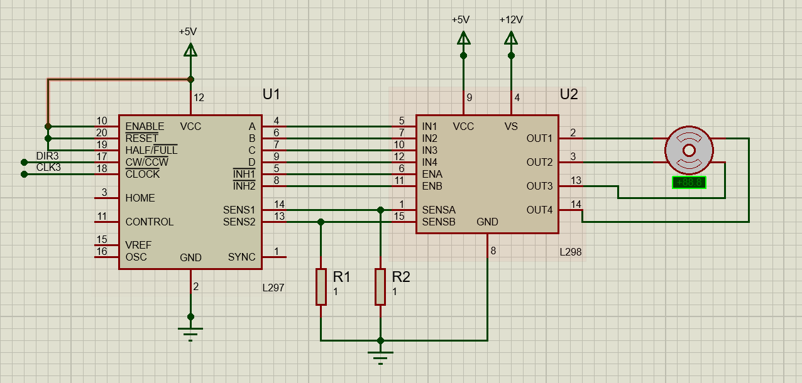
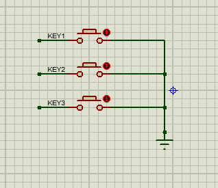
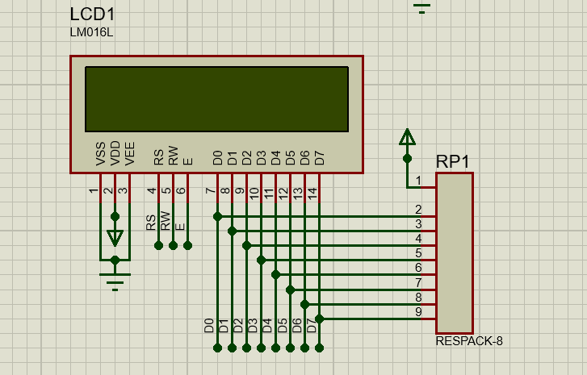
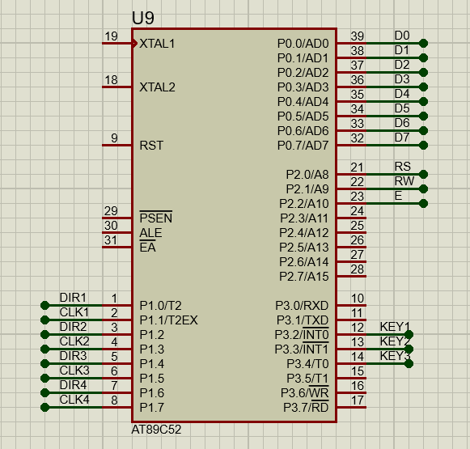
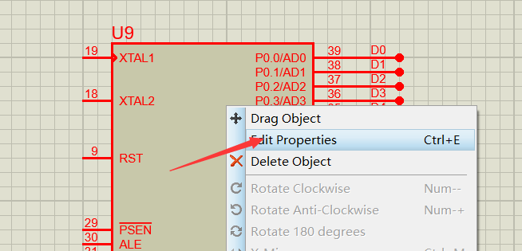
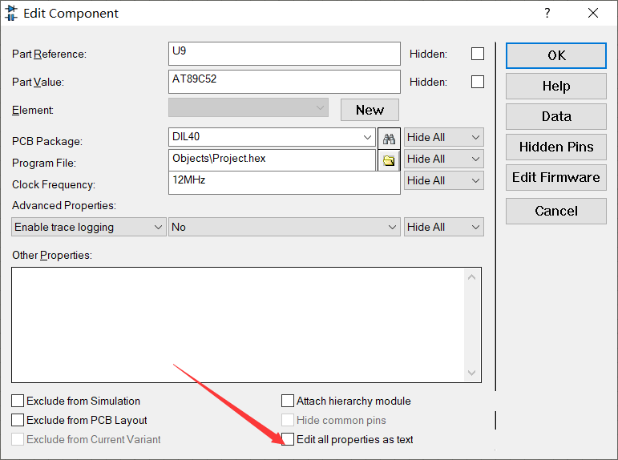
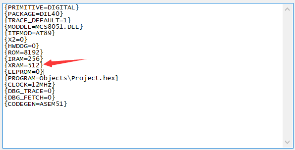
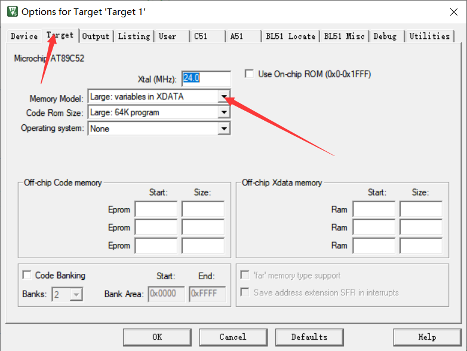

## 相关资料

[marlin代码解析](https://www.iteye.com/blog/chchcome-2214607)

[三角洲3d打印机是如何控制的，直角坐标与电机坐标的转换](https://www.bilibili.com/video/BV17E411d7zT?from=search&seid=6926163553242798113&spm_id_from=333.337.0.0)

本项目说明：基于51单片机的三角洲打印机设计仿真。

主要操作方向：改变3个由步进电机控制的滑块的位置T1,T2,T3(指每个滑块距离最低面的距离)，来控制喷头在空间中的位置，要将空间坐标转换为3个滑块距离底面的距离，然后将滑块移动到对应距离。

代码：

Gitee地址：https://gitee.com/snqx-lqh/sanjiaozhou

百度网盘：链接：https://pan.baidu.com/s/18FBAewdW1PunSMhK99KInw  提取码：pf3d 

## 硬件平台

### 电机驱动

使用L297加L298控制四线步进电机

CW/CWW是控制电机方向，高电平正转，低电平反转。

CLOCK是时钟信号，给一个脉冲，便会有一个步进。

HALF/FULL是选择一次半步进还是全步进。假如电机步进一次90°，那么半步进就是45°。



### 按键电路

拿来模拟限位开关，手动点击模拟电机走到了头。



### LCD1602显示电路

用LCD1602来做显示，主要用于显示T1,T2,T3的长度。



### 51单片机，控制及其引脚分布



​	    注意一点就是我们在编代码的时候，有可能会遇到内存不够的情况，就需要外扩一块RAM，至少我在做这个的时候遇到了这个问题，然后需要执行以下操作。

1、右键单片机，编辑属性



2、点击Edit



3、将XRAM的0改大成512



## 软件开发

### 调通LCD1602显示

LCD初始化程序使用的是普中的初始化代码，下面的显示函数使用的是宋学松老师手把手教你学51单片机中的代码。

```c
/* 设置显示 RAM 起始地址，亦即光标位置，(x,y)-对应屏幕上的字符坐标 */
void LcdSetCursor(unsigned char x, unsigned char y)
{
	unsigned char addr;

	if (y == 0) //由输入的屏幕坐标计算显示 RAM 的地址
		addr = 0x00 + x; //第一行字符地址从 0x00 起始
	else
		addr = 0x40 + x; //第二行字符地址从 0x40 起始
	LcdWriteCom(addr | 0x80); //设置 RAM 地址
}
/* 在液晶上显示字符串，(x,y)-对应屏幕上的起始坐标，str-字符串指针 */
void LcdShowStr(unsigned char x, unsigned char y, unsigned char *str)
{
	LcdSetCursor(x, y); //设置起始地址
	while (*str != '\0') //连续写入字符串数据，直到检测到结束符
	{
		LcdWriteData(*str++); //先取 str 指向的数据，然后 str 自加 1
	}
}
```

然后初始化后在While中放上LCD的显示代码。sprintf是将后面这串字符串放到前面定义的数组中去。

```c
u8 Disp1[16] ={0};
u8 Disp2[16] ={0};

void main()
{
	LcdInit();
	while(1)
	{
		sprintf((char *)Disp1,"T1:%5dT2:%5d",T1_Length,T2_Length);
		LcdShowStr(0, 0, Disp1);
		sprintf((char *)Disp2,"T3:%5dP :%5d",T3_Length,(u16)point_states);
		LcdShowStr(0, 1, Disp2);
	}
}
```

### 调通一个步进电机的运动

步进电机的状态改变，我放在了定时器里面，我定的5ms进入一次定时器，放在While中的话会由于屏幕显示影响到步进电机的运动。

```c
void NowToAim(u16 aim_length[3])
{
	//第一个
	if(T1_Length<aim_length[0])//假如T1_Length小于目标的，就正转
	{
		DIR1 = 1;
		CLK1 = !CLK1;
		if(CLK1==1)//一个脉冲是由一个高电平一个低电平组成的，所以要变换两次，步进电机才动一次
			T1_Length+=1;
	}else if(T1_Length>aim_length[0])
	{
		DIR1 = 0;
		CLK1 = !CLK1;
		if(CLK1==1)
			T1_Length-=1;
	}else
	{
		CLK1=0;
	}
	//第二个
	if(T2_Length<aim_length[1])
	{
		DIR2 = 1;
		CLK2 = !CLK2;
		if(CLK2==1)
			T2_Length+=1;
	}else if(T2_Length>aim_length[1])
	{
		DIR2 = 0;
		CLK2 = !CLK2;
		if(CLK2==1)
			T2_Length-=1;
	}else
	{
		CLK2=0;
	}
	//第三个
	if(T3_Length<aim_length[2])
	{
		DIR3 = 1;
		CLK3 = !CLK3;
		if(CLK3==1)
			T3_Length+=1;
	}else if(T3_Length>aim_length[2])
	{
		DIR3 = 0;
		CLK3 = !CLK3;
		if(CLK3==1)
			T3_Length-=1;
	}else
	{
		CLK3=0;
	}
	//第四个，这个电机拿来出料，所以会一直转动
	DIR4 = 1;
	CLK4 = !CLK4;	
}

```

### 调通所有电机的复位

​		每个电机都会在开始的时候移动到最顶端，由限位开关确定他们的位置。也是在定时器中，会不断的扫描按键状态，当模拟的限位开关按下后，对应滑块的长度就会定位成最长。这里的长度，算的是步进的次数，意思是指从底部到顶部步进电机的步进次数为MAX_LENGTH。例如本代码，一根杆T1长度实长为850mm，步进电机转一圈滑块走10Πmm，就是近31.4mm，选的是1.8°步进的电机，选用的半步进状态，走一步0.9°，那么总的步进次数就是850/(31.4/(360/0.9))=10828步，MAX_LENGTH就为10828步。

```c
void KeyScan()
{
	static int keycount = 0;
	static int keystate = 0;
	if(KEY1==0&&keystate==0)//按键按下
	{
		keycount++;
		if(keycount>2&&KEY1==0&&keystate==0)//加两次类似延迟10ms，不好解释
		{
			T1_Length = MAX_LENGTH;//将现在值设为最大
			keystate=1;
		}			
	}else if(KEY2==0&&keystate==0)
	{
		keycount++;
		if(keycount>2&&KEY2==0&&keystate==0)
		{
			T2_Length = MAX_LENGTH;
			keystate=1;
		}	
	}else if(KEY3==0&&keystate==0)
	{
		keycount++;
		if(keycount>2&&KEY3==0&&keystate==0)
		{
			T3_Length = MAX_LENGTH;
			keystate=1;
		}	
	}
	else if(KEY1==1&&KEY2==1&&KEY3==1&&keystate==1)//当所有按键都处于抬起状态，状态刷新
	{
		keycount=0;
		keystate=0;
	}
}
```

### 调通坐标转换

这里可以仔细研读最上面的两个资料进行理解

```c
float delta_diagonal_rod_2; //推杆长的平方
float delta_tower1_x;       //是左前柱的x坐标值，是由radius这个参数算出来的
float delta_tower1_y;       //是左前柱的y坐标值，是由radius这个参数算出来的
float delta_tower2_x;       //是右前柱的x坐标值，是由radius这个参数算出来的
float delta_tower2_y;       //是右前柱的y坐标值，是由radius这个参数算出来的
float delta_tower3_x;       //是后中柱的x坐标值，是由radius这个参数算出来的
float delta_tower3_y;       //是后中柱的y坐标值，是由radius这个参数算出来的

//初始化计算坐标所需参数
void recalc_delta_settings(float radius, float diagonal_rod)
{
    delta_tower1_x = -0.866 * radius;  //-SIN_60 * radius // front lefttower
    delta_tower1_y = -0.5 * radius;    //-COS_60 * radius
    delta_tower2_x = 0.866 * radius;   //SIN_60 * radius // front right tower
    delta_tower2_y = -0.5 * radius;    //-COS_60 * radius
    delta_tower3_x = 0.0;              // back middle tower
    delta_tower3_y = radius;
    delta_diagonal_rod_2 = sq(diagonal_rod);
}
//将坐标转化为T1,T2,T3长度
//delta是T1,T2,T3长度，cartesian是实际坐标
void calculate_delta(float delta[3],float cartesian[3])
{
    delta[X_AXIS] = sqrt(delta_diagonal_rod_2 - sq(delta_tower1_x - cartesian[X_AXIS]) - sq(delta_tower1_y - cartesian[Y_AXIS])) + cartesian[Z_AXIS];
    delta[Y_AXIS] = sqrt(delta_diagonal_rod_2 - sq(delta_tower2_x - cartesian[X_AXIS]) - sq(delta_tower2_y - cartesian[Y_AXIS])) + cartesian[Z_AXIS];
    delta[Z_AXIS] = sqrt(delta_diagonal_rod_2 - sq(delta_tower3_x - cartesian[X_AXIS]) - sq(delta_tower3_y - cartesian[Y_AXIS])) + cartesian[Z_AXIS];
}	
```

知道了坐标转换，知道了怎么把电机移动到对应长度，整个代码就差不多了,然后将目标点的坐标给入，然后进行转换。

```c
//目标点坐标，单位mm
float  aim_cartesian_arr[2][3] = {{100,20,50},
								  {-60,70,30},};
//目标点坐标转换为T1、T2、T3长度
float  aim_length_arr_temp[2][3] = {0};
//将长度转换成步进电机步进
u16    aim_length_arr[2][3] = {0};

void PrinterInit()
{
	int    i,j;
	recalc_delta_settings(_RADIUS,_DIAGONAL_ROD);//初始化计算坐标所需参数
	for(i=0;i<2;i++)//坐标转换为T1、T2、T3的计算
	{
		calculate_delta(aim_length_arr_temp[i],aim_cartesian_arr[i]);
	}
	for(i=0;i<2;i++)//将长度转换成步进电机步进
	{
		for(j=0;j<3;j++)
			aim_length_arr[i][j] = (u16)(aim_length_arr_temp[i][j]/step_value);
	}
}
```

## 常见错误
### main.c(295): error C249: 'DATA': SEGMENT TOO LARGE

写代码中会遇到这种情况，只需进行以下操作，在魔术棒配置中将Memory Model改成如下选项


